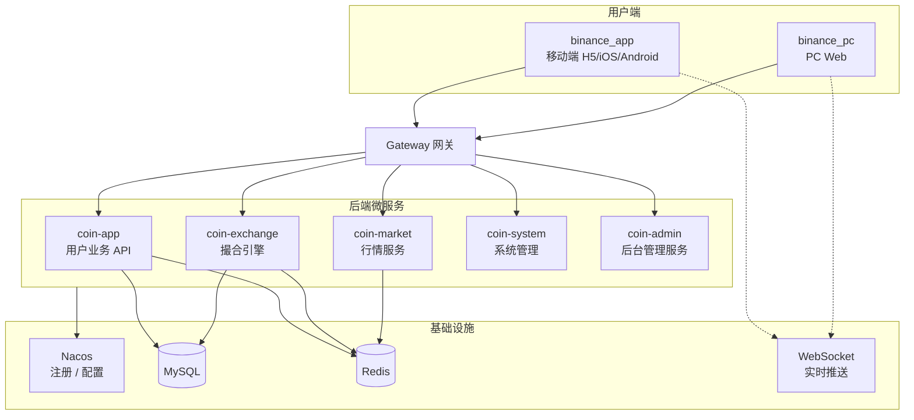

<p align="center">
	
</p>

<h1 align="center">Crypto Exchange — 数字资产交易所解决方案</h1>

<p align="center">
  
  
  
  
  
  
  
</p>

<p align="center">
  <strong>语言 / Language:</strong> 中文 | <a href="./README_EN.md">English</a> | <a href="./README_JA.md">日本語</a> | <a href="./README_KO.md">한국어</a>
</p>

<p align="center">
  一套完整的<strong>中心化数字资产交易所</strong>解决方案，覆盖移动端、PC Web、运营管理后台与微服务后端。<br/>
  支持现货、杠杆、U 本位/币本位合约、充提划转、实时行情与 K 线。欢迎在线体验，源码与部署请咨询客服。
</p>

---

## 在线演示

| 端 | 地址 | 说明 |
|----|------|------|
| **App H5** | [http://45.76.150.181:8089/](http://45.76.150.181:8089/) | 移动端浏览器体验 |
| **PC Web** | [http://45.76.150.181:8091/](http://45.76.150.181:8091/) | 桌面端完整交易工作区 |

| 演示账号 | 密码 | 邮箱验证码 |
|----------|------|------------|
| `111@gmail.com` | `111111` | `123456` |

> 演示环境仅供功能体验，数据会定期重置，请勿用于真实资产操作。

---

## 功能特性

- **多端覆盖** — 移动端 App（H5 / iOS / Android）、PC Web 用户端、运营管理后台
- **现货 & 杠杆** — 限价/市价/止盈止损、深度盘口、K 线联动、借还币
- **合约交易** — U 本位 & 币本位、逐仓/全仓、杠杆调节、资金费率、强平计算
- **资产管理** — 充币/提币（多链网络）、账户划转、全账单追踪
- **实时行情** — WebSocket 推送价格、盘口、成交、K 线
- **账户安全** — KYC、Google 验证、资金密码、登录保护
- **运营能力** — Banner、公告、消息中心、在线客服、邀请体系
- **国际化** — 简体中文 / 繁体中文 / English
- **可扩展** — 前后端分离、微服务架构，支持按模块定制

---

## 项目组成

本方案采用**模块化架构**，各端可独立部署、组合交付：

| 模块 | 说明 | 技术栈 |
|------|------|--------|
| **binance_app** | 移动端用户端 | uni-app + Vue 3 + Vite |
| **binance_pc** | PC Web 用户端 | Vue 3 + TypeScript + Element Plus |
| **binance_coin** | 后端微服务 | Spring Boot 3 + Spring Cloud + Nacos |

移动端与 PC 端共用同一套后端 API（`coin-app` 微服务），功能对齐。

> 本仓库为**项目展示与介绍入口**，包含在线演示、功能截图与系统架构说明。完整源码请通过下方联系方式获取。

---

## 系统架构



**请求链路：** 前端 → Gateway → 微服务 → MySQL / Redis  
**实时数据：** WebSocket 独立通道推送行情、盘口、成交

---

## 技术栈

| 层级 | 技术 | 说明 |
|------|------|------|
| 移动端 | uni-app、Vue 3、Vite、Pinia、vk-uview-ui | H5 / iOS / Android |
| PC 端 | Vue 3、TypeScript、Vite、Element Plus | 固定 1280px+ 桌面布局 |
| 管理端 | Vue 3、Element Plus、Avue | 运营管理 + 业务配置 |
| 后端框架 | Spring Boot 3.2、Spring Cloud Alibaba | Java 17 |
| 微服务 | Nacos、Gateway、OpenFeign | 服务注册与路由 |
| 数据存储 | MySQL、Redis、MyBatis-Plus | 业务数据 + 缓存 |
| 实时通信 | WebSocket（MQTT 协议封装） | 行情 / 深度 / K 线 / 成交 |
| 图表 | lightweight-charts | K 线展示 |
| 构建 | Maven（后端）、Vite（前端） | — |

---

## 页面展示

### App 移动端

<table align="center">
  <tr>
    <td align="center"></td>
    <td align="center"></td>
    <td align="center"></td>
    <td align="center"></td>
  </tr>
  <tr>
    <td align="center"></td>
    <td align="center"></td>
    <td align="center"></td>
    <td align="center"></td>
  </tr>
</table>

### PC Web 端

<table align="center">
  <tr>
    <td align="center"></td>
    <td align="center"></td>
  </tr>
  <tr>
    <td align="center"></td>
    <td align="center"></td>
  </tr>
  <tr>
    <td align="center"></td>
    <td align="center"></td>
  </tr>
  <tr>
    <td align="center"></td>
    <td align="center"></td>
  </tr>
</table>

### 管理端

<table align="center">
  <tr>
    <td align="center"></td>
    <td align="center"></td>
    <td align="center"></td>
    <td align="center"></td>
  </tr>
  <tr>
    <td align="center"></td>
    <td align="center"></td>
    <td align="center"></td>
    <td align="center"></td>
  </tr>
</table>

---

## 目录结构

<details open>
<summary><strong>binance_app — 移动端</strong></summary>

```
binance_app/
├── pages/              # 主包 Tab 页（首页、行情、交易、合约、资产）
├── sub_package/        # 分包（登录、K线、充提、账单、设置等 40+ 页面）
├── components/         # 业务组件（custom-kline、custom-trade-order 等）
├── config/             # api.js、baseConfig.js
├── utils/              # request、websocket、coin 格式化
└── locale/             # 国际化（简中 / 繁中 / English）
```

</details>

<details open>
<summary><strong>binance_pc — PC Web 端</strong></summary>

```
binance_pc/
├── src/views/          # 页面（index、trade、contract、bills、settings）
├── src/components/     # 业务组件（custom-kline、custom-trade-depth 等）
├── src/router/         # 路由（routes-constants.ts 统一管理路径）
├── src/config/         # api.ts、baseConfig.ts
└── src/utils/          # request、websocket、全局弹窗控制器
```

</details>

<details open>
<summary><strong>binance_coin — 后端微服务</strong></summary>

```
binance_coin/
├── coin-gateway/              # API 网关
├── coin-service/
│   ├── coin-service-app/      # coin-app 用户业务
│   ├── coin-service-exchange/ # coin-exchange 撮合引擎
│   ├── coin-service-market/   # coin-market 行情
│   ├── coin-service-system/   # coin-system 系统管理
│   └── coin-service-message/  # 消息通知
├── coin-common/               # 公共模块（Starter、工具类）
└── coin-service-api/          # RPC 接口定义
```

</details>

---

## 商业支持

如需**完整源码授权、定制开发、部署上线**等服务，可通过以下方式联系：

<table align="center">
  <tr>
    <td align="center" valign="top">
      <a href="https://t.me/BITCOIN1688" target="_blank">Telegram 客服</a><br/>
      
    </td>
    <td align="center" valign="top">
      <a href="https://t.me/bitcoin5201688" target="_blank">Telegram 群组</a><br/>
      
    </td>
  </tr>
</table>

---

## FAQ

### 如何获取源码？
本仓库为功能展示用途，不含完整源码。如需源码授权、部署方案或定制开发，请通过上方 Telegram 联系。

### 是否支持二次开发？
支持。可按业务需求调整 UI、交易流程、资产模块及运营功能，前后端分离架构便于扩展。

### 是否包含前后端？
方案覆盖移动端、PC Web、运营管理后台与微服务后端，可按需组合交付。

### 支持哪些平台？
移动端：H5、iOS、Android；桌面端：PC Web；管理端：浏览器访问。

### 是否可以协助部署上线？
可以。支持测试环境与正式环境部署、域名配置及基础联调，详情请联系客服。

---

## 免责声明

本项目为数字资产交易系统的技术展示与二次开发基座，**不构成任何投资建议或金融服务承诺**。

- 仅用于学习研究、功能演示和技术开发评估，不用于未经许可的真实金融业务运营
- 数字资产及杠杆交易风险较高，任何上线、运营、推广及合规责任由使用方自行承担
- 本项目按「现状」提供，不对可用性、稳定性、安全性及收益作任何明示或默示担保
- 若涉及用户数据采集与处理，请使用方自行满足所在地区法律法规及隐私合规要求
- 本项目为参考主流交易所交互风格的实现，**非 Binance/币安官方产品**，与其无合作或授权关系
