<p align="center">
	
</p>
<h4 align="center">BitCoin开源交易所</h4>
<p align="center">
 
 
 
 
 
 
 
 
 
</p>

<p align="center">
  <strong>语言 / Language:</strong> 中文 | <a href="./README_EN.md">English</a> | <a href="./README_JA.md">日本語</a> | <a href="./README_KO.md">한국어</a>
</p>


> **本项目是一套区块链数字资产交易所前端系统**，覆盖用户端交易、资产管理与账户中心等核心场景。  
> 支持现货交易、合约交易、充币提币、资金划转、行情订阅、K 线展示、多语言与多端发布能力。  
> 适用于交易所业务快速搭建与二次开发，可按品牌与运营需求灵活扩展业务模块并对接后端服务。

### App 页面展示

<table align="center">
  <tr>
    <td align="center">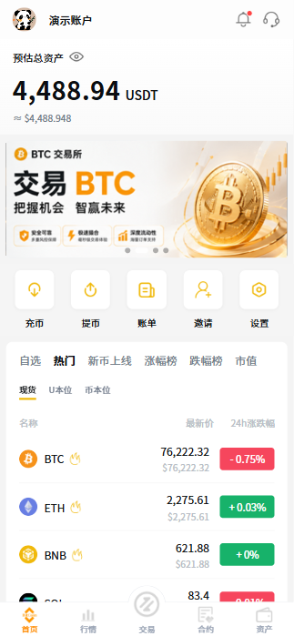</td>
    <td align="center">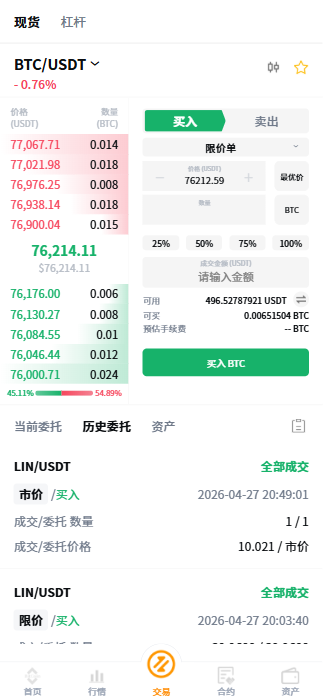</td>
    <td align="center">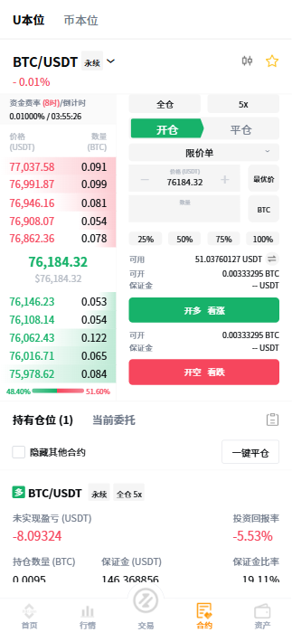</td>
    <td align="center">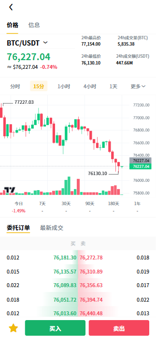</td>
  </tr>
  <tr>
    <td align="center">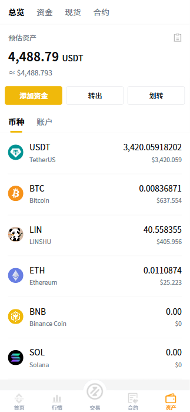</td>
    <td align="center">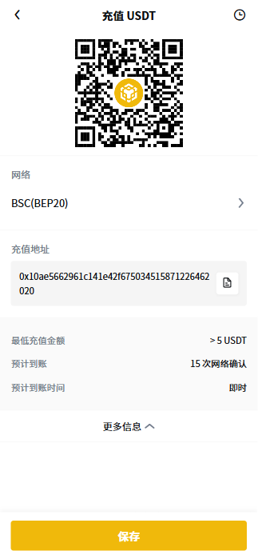</td>
    <td align="center">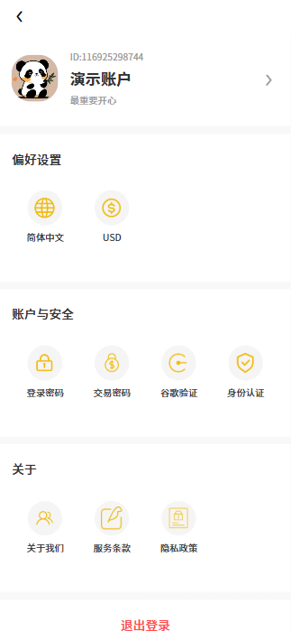</td>
    <td align="center">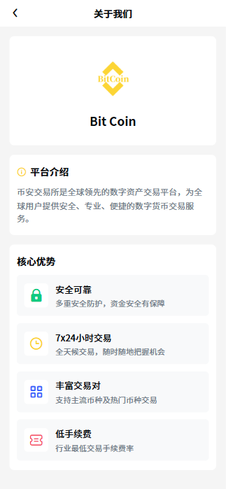</td>

  </tr>
</table>

### 管理端页面展示

<table align="center">
  <tr>
    <td align="center">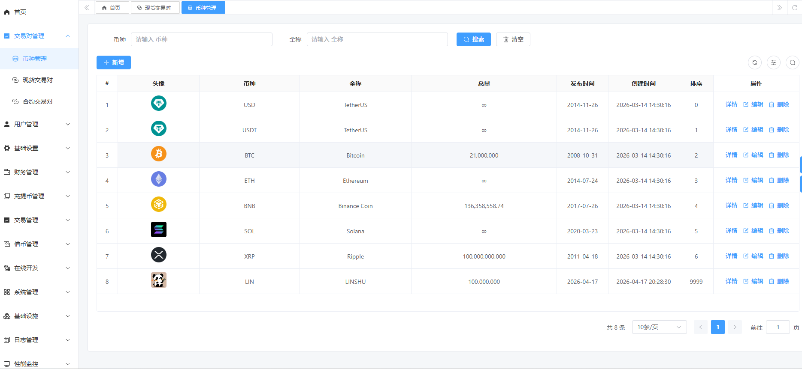</td>
    <td align="center">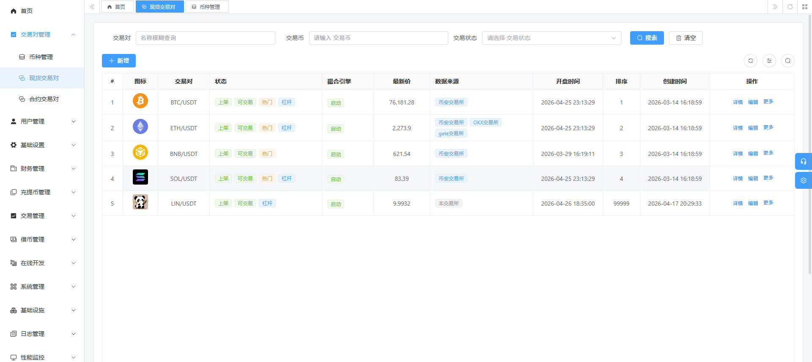</td>
    <td align="center">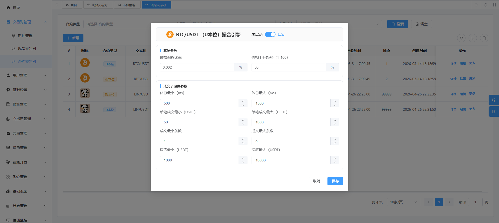</td>
        <td align="center">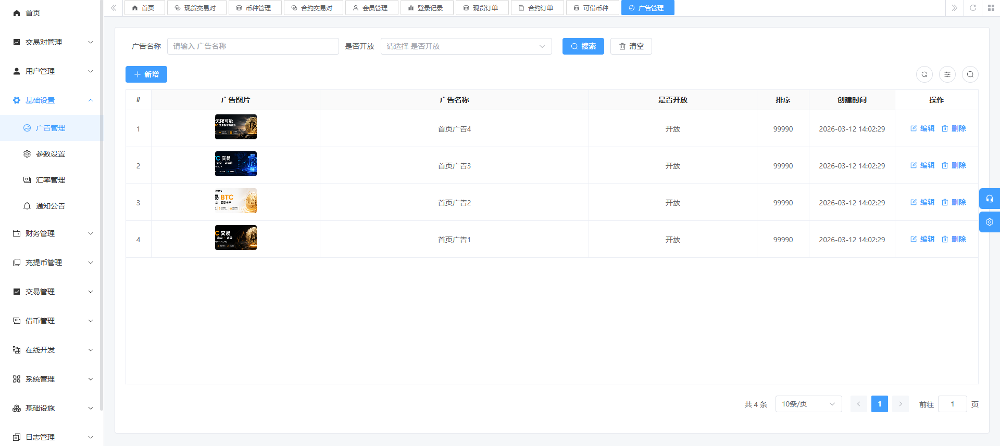</td>
  </tr>
  <tr>
    <td align="center">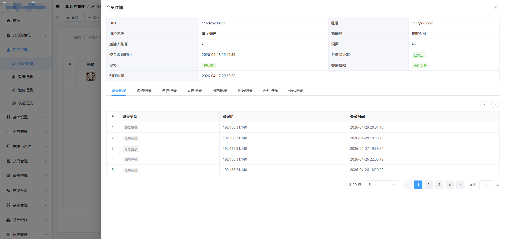</td>
    <td align="center">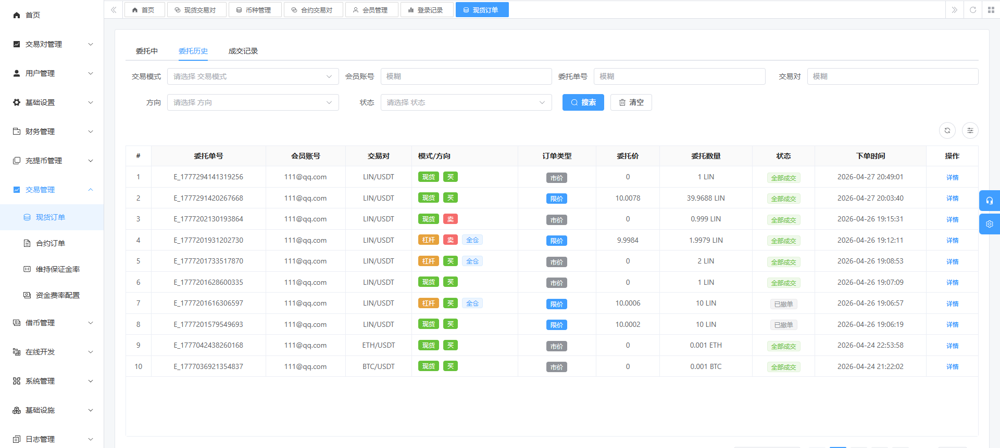</td>
    <td align="center">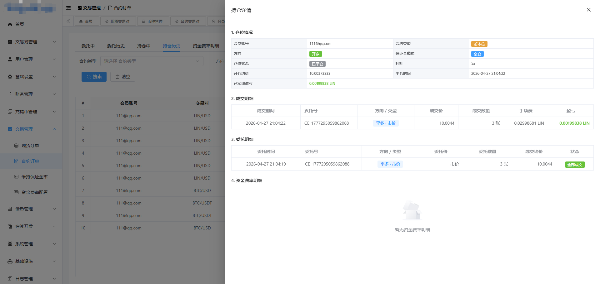</td>
        <td align="center">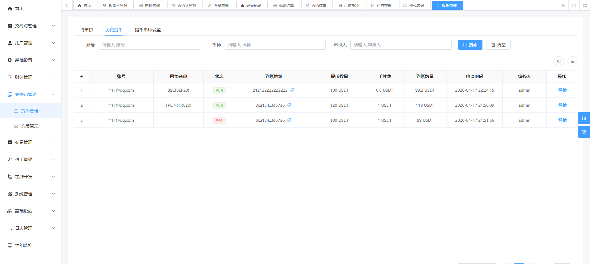</td>
  </tr>
</table>


``` 
binance_app（前端功能架构）
    ├── pages                                // 主包（Tab 页）
    │       └── index                        // 首页：资产总览、公告、运营位
    │       └── market                       // 行情：交易对列表、涨跌榜、搜索入口
    │       └── trade                        // 交易：现货/杠杆入口
    │       └── contract                     // 合约：U本位/币本位入口
    │       └── asset                        // 资产：首页总资产与账户概览
    ├── sub_package                          // 分包业务页
    │       └── login                        // 登录、注册、忘记密码
    │       └── trade                        // 现货详情、杠杆详情、下单交易
    │       └── contract                     // U本位合约、币本位合约、持仓与委托
    │       └── kline                        // K线图、深度图、实时成交
    │       └── fund                         // 充币、提币、网络选择、链上地址
    │       └── transfer                     // 资金划转（账户间划拨）
    │       └── borrow                       // 杠杆借贷（借币、还币）
    │       └── bill                         // 账单中心（现货/杠杆/合约/充提/划转）
    │       └── asset                        // 资产明细（现货、资金、合约账户）
    │       └── message                      // 消息中心与详情
    │       └── notice                       // 公告列表与公告详情
    │       └── search                       // 币对搜索
    │       └── setting                      // 设置、KYC、邀请、谷歌验证、密码管理
    │       └── customer                     // 在线客服
    ├── components                           // 业务组件
    │       └── custom-kline                 // K线图组件（lightweight-charts）
    │       └── custom-depth                 // 深度盘口组件
    │       └── custom-trade-order           // 交易下单组件
    │       └── custom-contract-order        // 合约下单组件
    │       └── custom-contract-position     // 合约持仓组件
    │       └── custom-contract-lever        // 合约杠杆调节
    │       └── custom-contract-stoploss     // 止盈止损
    │       └── custom-contract-addmargin    // 追加保证金
    │       └── custom-home-navbar           // 首页导航
    │       └── custom-navbar                // 通用导航栏
    │       └── custom-index-coinlist        // 首页币对列表
    │       └── custom-trade-select          // 交易参数选择
    │       └── custom-trade-countdown       // 交易倒计时
    │       └── custom-open-countdown        // 开盘倒计时
    │       └── custom-email-input           // 邮箱输入组件
    ├── config                               // 配置层
    │       └── api.js                       // 统一 API 定义（按业务模块）
    │       └── baseConfig.js                // 网关地址、WS 地址、应用配置
    ├── utils                                // 基础能力
    │       └── request.js                   // HTTP 请求封装与错误处理
    │       └── websocket.js                 // WebSocket 管理（连接、重连、订阅）
    │       └── websocket_*                  // 行情/深度/K线/成交推送封装
    │       └── interceptor.js               // 路由拦截与登录态控制
    │       └── coin.js                      // 币价与数量格式化工具
    │       └── storage.js                   // 本地缓存封装
    ├── locale                               // 国际化语言包（简中/繁中/English）
    ├── uni_modules/vk-uview-ui              // UI 组件库
    └── 核心特性                              // 功能能力汇总
            └── 现货交易 / 杠杆交易 / U本位合约 / 币本位合约
            └── 实时行情推送 / K线 / 深度盘口 / 实时成交
            └── 充币提币 / 资金划转 / 借贷还贷 / 全账单追踪
            └── 账户安全 / KYC / 多语言 / 多端发布（H5、iOS、Android）
```

``` 
binance_app（核心功能总览）
    ├── 用户与账户
    │       └── 注册 / 登录 / 找回密码
    │       └── 实名认证（KYC）/ 谷歌验证 / 资金密码
    │       └── 用户资料 / 安全设置 / 邀请体系
    ├── 行情中心
    │       └── 实时行情列表（现货 / U本位 / 币本位）
    │       └── 热门榜 / 涨跌榜 / 市值榜 / 新币榜
    │       └── 交易对搜索 / 自选管理 / 公告联动
    │       └── WebSocket 实时价格、成交、盘口推送
    ├── 交易中心（现货 / 杠杆）
    │       └── 限价单 / 市价单 / 止盈止损单
    │       └── 深度盘口 / 实时成交 / K线联动
    │       └── 当前委托 / 历史委托 / 一键撤单
    │       └── 杠杆借币 / 还币 / 风险提示
    ├── 合约中心（U本位 / 币本位）
    │       └── 开仓 / 平仓 / 逐仓全仓 / 杠杆调节
    │       └── 止盈止损 / 追加保证金 / 资金费率
    │       └── 当前持仓 / 历史持仓 / 当前委托 / 历史委托
    │       └── 强平价格 / 保证金率 / 盈亏实时计算
    ├── 资产与资金
    │       └── 总资产看板（现货 / 资金 / 合约账户）
    │       └── 充币 / 提币 / 网络选择（ERC20/TRC20/BEP20）
    │       └── 账户划转（现货、资金、合约账户互转）
    │       └── 账单明细（成交、充提、划转、借还）
    ├── 运营与服务
    │       └── Banner 运营位 / 首页推荐模块
    │       └── 公告列表与详情 / 消息中心
    │       └── 客服入口 / 常见问题 / 协议与隐私
    └── 平台能力
            └── 国际化（简中 / 繁中 / English）
            └── 多端发布（H5 / iOS / Android）
            └── 统一 API 接口层 + 可扩展业务模块
            └── 前后端分离架构，支持快速二次开发
```

### 联系方式

如需咨询源码授权、定制开发、部署上线与报价，请通过以下方式联系：

<table align="center">
  <tr>
    <td align="center" valign="top">
      <a href="https://t.me/web3_dev_gg" target="_blank">Telegram 商务咨询（点击直达）</a><br/>
      <br/>
    </td>
  </tr>
</table>

## FAQ

### 1）是否支持二次开发？
支持。可按你的业务需求调整 UI、交易流程、资产模块、公告运营位及接口对接逻辑。

### 2）是否包含前后端源码？
可提供前端与后端完整源码（按授权方案交付），并支持私有化部署。

### 3）是否可以协助部署上线？
可以。支持测试环境与正式环境部署、域名配置、Nginx 反向代理及基础联调。

### 4）是否支持多语言和多端发布？
支持。当前已适配简中/繁中/English，支持 H5、iOS、Android 多端发布。

### 5）如何联系你们？
可通过上方 Telegram 联系，建议附上需求清单、预算范围和期望上线时间，便于快速评估。

## 免责声明

本项目为数字资产交易系统的技术展示与二次开发基座，不构成任何投资建议或金融服务承诺。

- 仅用于学习研究、功能演示和技术开发评估，不用于未经许可的真实金融业务运营。
- 数字资产及杠杆交易风险较高，任何上线、运营、推广及合规责任由使用方自行承担。
- 本项目按“现状”提供，不对可用性、稳定性、安全性及收益作任何明示或默示担保。
- 若涉及用户数据采集与处理，请使用方自行满足所在地区法律法规及隐私合规要求。
- 本项目为参考主流交易所交互风格的实现，非 Binance/币安官方产品，与其无合作或授权关系。

