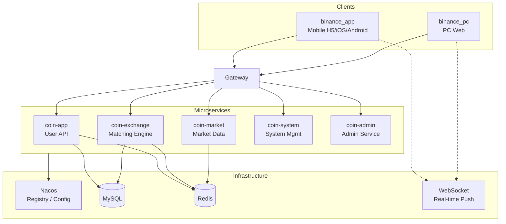
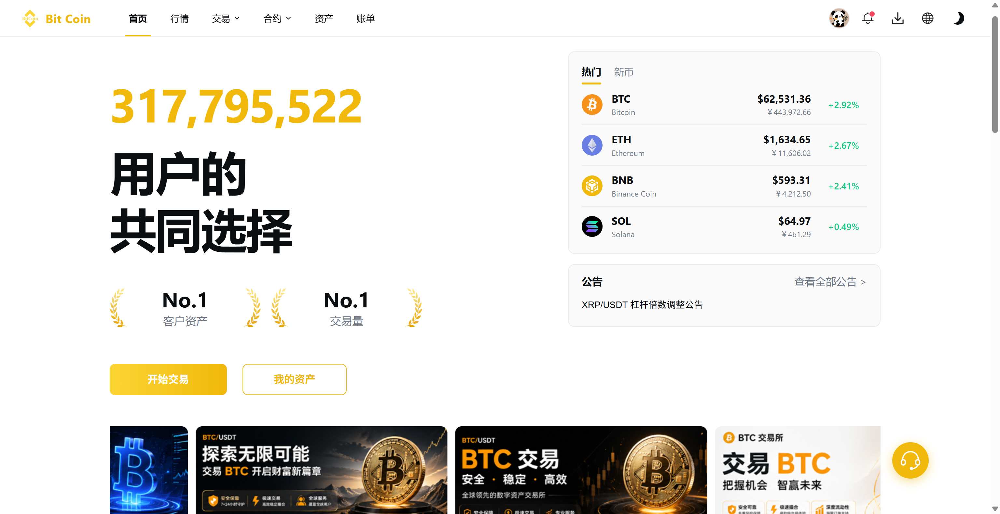
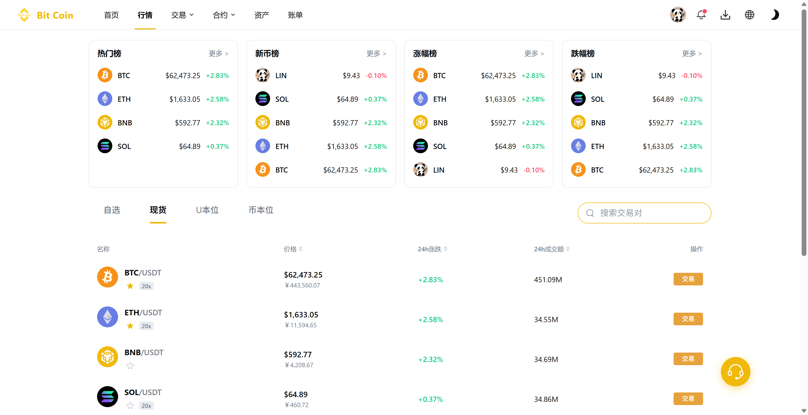
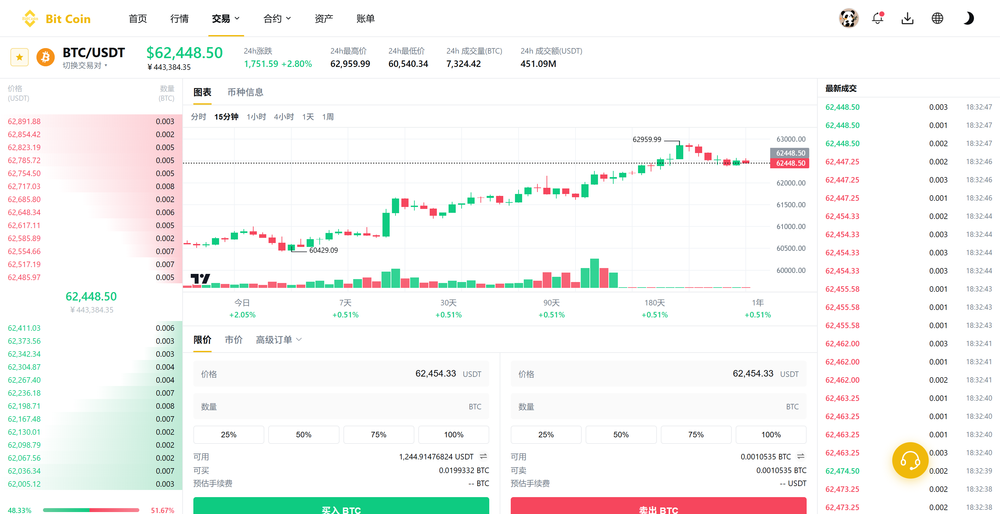
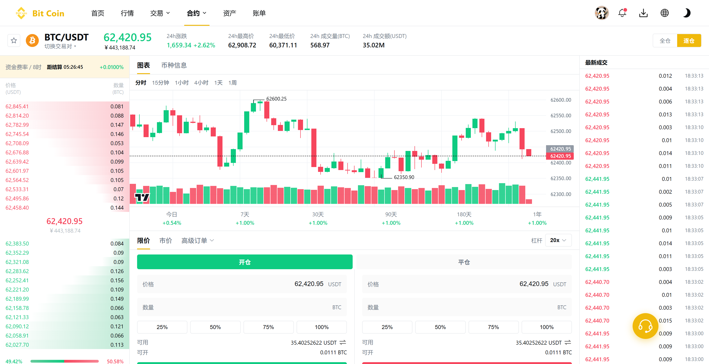
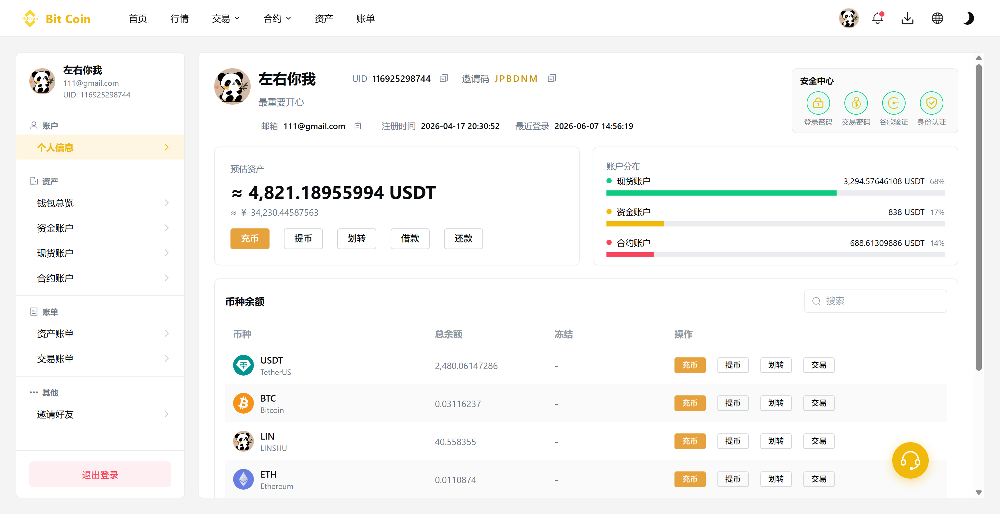
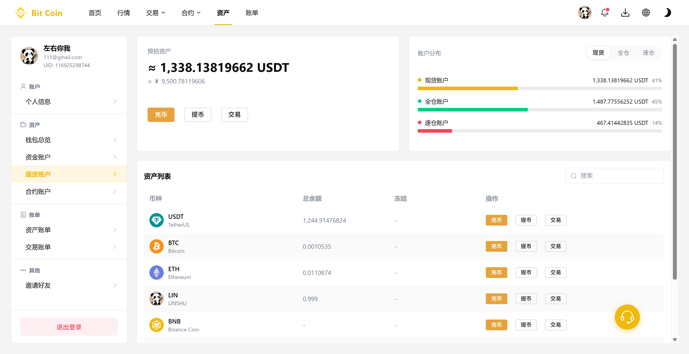
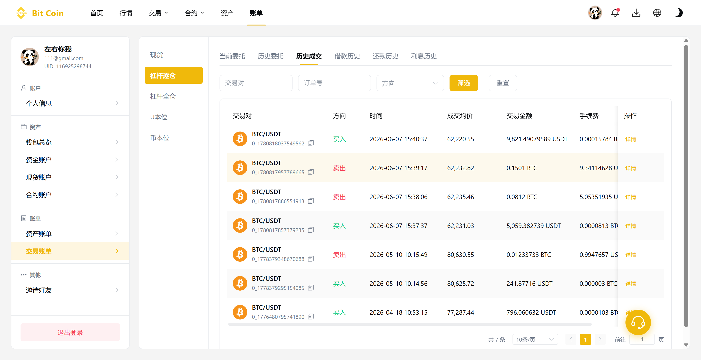
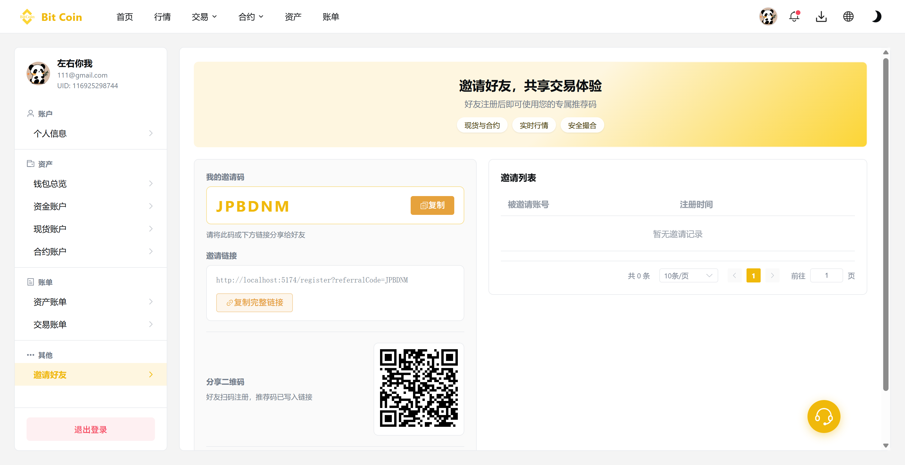
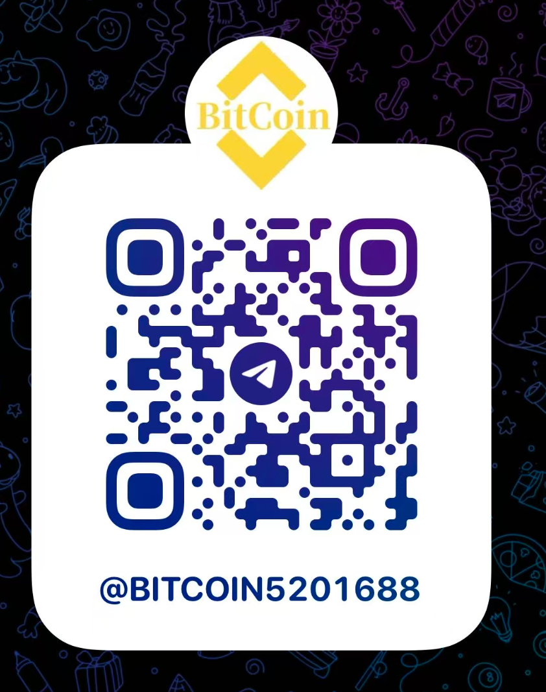

<p align="center">
	
</p>

<h1 align="center">Crypto Exchange — Digital Asset Trading Solution</h1>

<p align="center">
  
  
  
  
  
  
  
</p>

<p align="center">
  <strong>Language:</strong> <a href="./README.md">中文</a> | English | <a href="./README_JA.md">日本語</a> | <a href="./README_KO.md">한국어</a>
</p>

<p align="center">
  A complete <strong>centralized digital asset exchange</strong> solution covering mobile, PC Web, admin console, and microservice backend.<br/>
  Supports spot, margin, USDT-margined / coin-margined futures, deposit & withdrawal, transfers, real-time quotes, and K-line charts. Try the live demo — contact us for source code and deployment.
</p>

---

## Live Demo

| Platform | URL | Description |
|----------|-----|-------------|
| **App H5** | [http://45.76.150.181:8089/](http://45.76.150.181:8089/) | Mobile browser experience |
| **PC Web** | Same as above (or separate deployment URL) | Full desktop trading workspace |

| Demo Account | Password | Email Code |
|--------------|----------|------------|
| `111@gmail.com` | `111111` | `123456` |

> Demo environment is for feature preview only. Data may be reset periodically. Do not use for real assets.

---

## Features

- **Multi-platform** — Mobile App (H5 / iOS / Android), PC Web, admin console
- **Spot & Margin** — Limit / market / TP-SL orders, order book, K-line sync, borrow & repay
- **Futures** — USDT-margined & coin-margined, isolated / cross margin, leverage, funding rate, liquidation
- **Asset Management** — Deposit / withdrawal (multi-chain), transfers, full statement tracking
- **Real-time Market** — WebSocket price, order book, trades, K-line push
- **Account Security** — KYC, Google Auth, fund password, login protection
- **Operations** — Banners, announcements, message center, live support, referral
- **i18n** — Simplified Chinese / Traditional Chinese / English
- **Extensible** — Decoupled frontend & backend, microservice architecture, modular customization

---

## Project Modules

Modular architecture — each module can be deployed independently or combined:

| Module | Description | Stack |
|--------|-------------|-------|
| **binance_app** | Mobile client | uni-app + Vue 3 + Vite |
| **binance_pc** | PC Web client | Vue 3 + TypeScript + Element Plus |
| **binance_coin** | Backend microservices | Spring Boot 3 + Spring Cloud + Nacos |

Mobile and PC share the same backend API (`coin-app` microservice) with aligned features.

> This repository is a **showcase and overview entry point** with live demo links, screenshots, and architecture docs. Full source code is available via contact below.

---

## System Architecture



**Request flow:** Client → Gateway → Microservices → MySQL / Redis  
**Real-time data:** WebSocket channel for quotes, order book, and trades

---

## Tech Stack

| Layer | Technology | Notes |
|-------|------------|-------|
| Mobile | uni-app, Vue 3, Vite, Pinia, vk-uview-ui | H5 / iOS / Android |
| PC Web | Vue 3, TypeScript, Vite, Element Plus | Fixed 1280px+ desktop layout |
| Admin | Vue 3, Element Plus, Avue | Operations & business config |
| Backend | Spring Boot 3.2, Spring Cloud Alibaba | Java 17 |
| Microservices | Nacos, Gateway, OpenFeign | Service registry & routing |
| Storage | MySQL, Redis, MyBatis-Plus | Business data + cache |
| Real-time | WebSocket (MQTT wrapper) | Quotes / depth / K-line / trades |
| Charts | lightweight-charts | K-line display |
| Build | Maven (backend), Vite (frontend) | — |

---

## Screenshots

### Mobile App

<table align="center">
  <tr>
    <td align="center"></td>
    <td align="center"></td>
    <td align="center"></td>
    <td align="center"></td>
  </tr>
  <tr>
    <td align="center"></td>
    <td align="center"></td>
    <td align="center"></td>
    <td align="center"></td>
  </tr>
</table>

### PC Web

<table align="center">
  <tr>
    <td align="center"></td>
    <td align="center"></td>
  </tr>
  <tr>
    <td align="center"></td>
    <td align="center"></td>
  </tr>
  <tr>
    <td align="center"></td>
    <td align="center"></td>
  </tr>
  <tr>
    <td align="center"></td>
    <td align="center"></td>
  </tr>
</table>

### Admin Console

<table align="center">
  <tr>
    <td align="center"></td>
    <td align="center"></td>
    <td align="center"></td>
    <td align="center"></td>
  </tr>
  <tr>
    <td align="center"></td>
    <td align="center"></td>
    <td align="center"></td>
    <td align="center"></td>
  </tr>
</table>

---

## Directory Structure

<details>
<summary><strong>binance_app — Mobile</strong></summary>

```
binance_app/
├── pages/              # Main tab pages (home, market, trade, futures, assets)
├── sub_package/        # Sub-packages (login, K-line, fund, bills, settings, 40+ pages)
├── components/         # Business components (custom-kline, custom-trade-order, etc.)
├── config/             # api.js, baseConfig.js
├── utils/              # request, websocket, coin formatting
└── locale/             # i18n (zh-Hans / zh-Hant / English)
```

</details>

<details>
<summary><strong>binance_pc — PC Web</strong></summary>

```
binance_pc/
├── src/views/          # Pages (index, trade, contract, bills, settings)
├── src/components/     # Business components (custom-kline, custom-trade-depth, etc.)
├── src/router/         # Routes (routes-constants.ts)
├── src/config/         # api.ts, baseConfig.ts
└── src/utils/          # request, websocket, global modal controllers
```

</details>

<details>
<summary><strong>binance_coin — Backend Microservices</strong></summary>

```
binance_coin/
├── coin-gateway/              # API Gateway
├── coin-service/
│   ├── coin-service-app/      # coin-app user business
│   ├── coin-service-exchange/ # coin-exchange matching engine
│   ├── coin-service-market/   # coin-market quotes
│   ├── coin-service-system/   # coin-system system management
│   └── coin-service-message/  # messaging
├── coin-common/               # Shared modules (starters, utilities)
└── coin-service-api/          # RPC interface definitions
```

</details>

---

## Commercial Support

For **full source licensing, custom development, and deployment**, contact us via:

<table align="center">
  <tr>
    <td align="center" valign="top">
      <a href="https://t.me/BITCOIN1688" target="_blank">Telegram Support</a><br/>
      
    </td>
    <td align="center" valign="top">
      <a href="https://t.me/bitcoin5201688" target="_blank">Telegram Group</a><br/>
      
    </td>
  </tr>
</table>

---

## FAQ

### How to get the source code?
This repository is for showcase only and does not include full source code. For licensing, deployment, or custom development, please contact us via Telegram above.

### Do you support customization?
Yes. UI, trading flows, asset modules, and operations can be tailored to your requirements with a decoupled architecture.

### Does it include frontend and backend?
The solution covers mobile, PC Web, admin console, and microservice backend — deliverable in flexible combinations.

### Which platforms are supported?
Mobile: H5, iOS, Android; Desktop: PC Web; Admin: browser-based.

### Can you help with deployment?
Yes. We support staging and production deployment, domain setup, and basic integration. Contact us for details.

---

## Disclaimer

This project is a technical showcase and development base for digital asset exchange systems. **It does not constitute investment advice or any financial service commitment.**

- For learning, demonstration, and technical evaluation only — not for unauthorized financial operations
- Crypto and leveraged trading involve high risk; compliance and operational liability rests with the operator
- Provided "as is" without warranties of availability, stability, security, or profitability
- If user data is collected, the operator must comply with applicable laws and privacy regulations
- Inspired by mainstream exchange UX patterns — **not an official Binance product**, with no affiliation or authorization from Binance
