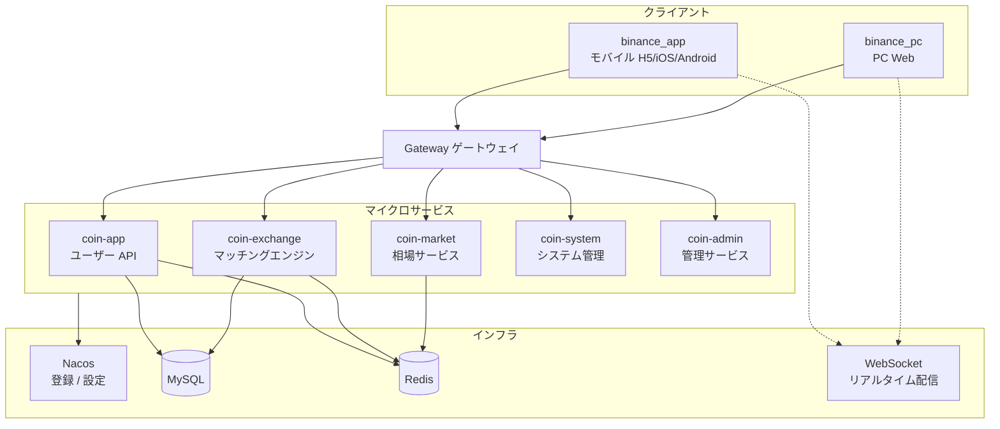

<p align="center">
	
</p>

<h1 align="center">Crypto Exchange — デジタル資産取引所ソリューション</h1>

<p align="center">
  
  
  
  
  
  
  
</p>

<p align="center">
  <strong>Language:</strong> <a href="./README_EN.md">English</a> | <a href="./README.md">中文</a> | 日本語 | <a href="./README_KO.md">한국어</a>
</p>

<p align="center">
  モバイル、PC Web、運営管理画面、マイクロサービスバックエンドを網羅する<strong>集中型デジタル資産取引所</strong>ソリューション。<br/>
  現物、レバレッジ、USDT建て/コイン建て先物、入出金、振替、リアルタイム相場、Kラインに対応。オンラインデモをお試しください — ソースコード・導入はお問い合わせください。
</p>

---

## オンラインデモ

| 端末 | URL | 説明 |
|------|-----|------|
| **App H5** | [http://45.76.150.181:8089/](http://45.76.150.181:8089/) | モバイルブラウザ体験 |
| **PC Web** | 上記と同じ（または独立デプロイURL） | デスクトップ取引ワークスペース |

| デモアカウント | パスワード | メール認証コード |
|----------------|------------|------------------|
| `111@gmail.com` | `111111` | `123456` |

> デモ環境は機能体験専用です。データは定期的にリセットされる場合があります。実資産の操作はしないでください。

---

## 機能特性

- **マルチプラットフォーム** — モバイル App（H5 / iOS / Android）、PC Web、運営管理画面
- **現物 & レバレッジ** — 指値/成行/TP-SL、板情報、Kライン連動、借入/返済
- **先物取引** — USDT建て & コイン建て、分離/クロス、レバレッジ、資金調達率、強制決済
- **資産管理** — 入出金（マルチチェーン）、振替、全明細追跡
- **リアルタイム相場** — WebSocket 価格、板、約定、Kライン配信
- **アカウントセキュリティ** — KYC、Google認証、資金パスワード、ログイン保護
- **運営機能** — バナー、公告、メッセージ、カスタマーサポート、招待
- **多言語** — 簡体字中国語 / 繁体字中国語 / English
- **拡張性** — フロント/バック分離、マイクロサービス、モジュール単位のカスタマイズ

---

## プロジェクト構成

モジュール型アーキテクチャ — 各モジュールは独立デプロイまたは組み合わせ可能：

| モジュール | 説明 | 技術スタック |
|------------|------|--------------|
| **binance_app** | モバイルクライアント | uni-app + Vue 3 + Vite |
| **binance_pc** | PC Web クライアント | Vue 3 + TypeScript + Element Plus |
| **binance_coin** | バックエンドマイクロサービス | Spring Boot 3 + Spring Cloud + Nacos |

モバイルと PC は同一バックエンド API（`coin-app` マイクロサービス）を共有し、機能が一致しています。

> 本リポジトリは**プロジェクト紹介・展示用の入口**です。デモ、スクリーンショット、構成図を掲載。完全なソースコードは下記よりお問い合わせください。

---

## システム構成



**リクエスト経路：** クライアント → Gateway → マイクロサービス → MySQL / Redis  
**リアルタイムデータ：** WebSocket で相場、板、約定を配信

---

## 技術スタック

| レイヤー | 技術 | 説明 |
|----------|------|------|
| モバイル | uni-app、Vue 3、Vite、Pinia、vk-uview-ui | H5 / iOS / Android |
| PC Web | Vue 3、TypeScript、Vite、Element Plus | 1280px+ 固定デスクトップレイアウト |
| 管理画面 | Vue 3、Element Plus、Avue | 運営管理 + 業務設定 |
| バックエンド | Spring Boot 3.2、Spring Cloud Alibaba | Java 17 |
| マイクロサービス | Nacos、Gateway、OpenFeign | サービス登録とルーティング |
| ストレージ | MySQL、Redis、MyBatis-Plus | 業務データ + キャッシュ |
| リアルタイム | WebSocket（MQTT ラッパー） | 相場 / 板 / Kライン / 約定 |
| チャート | lightweight-charts | Kライン表示 |
| ビルド | Maven（バックエンド）、Vite（フロント） | — |

---

## 画面展示

### モバイル App

<table align="center">
  <tr>
    <td align="center"></td>
    <td align="center"></td>
    <td align="center"></td>
    <td align="center"></td>
  </tr>
  <tr>
    <td align="center"></td>
    <td align="center"></td>
    <td align="center"></td>
    <td align="center"></td>
  </tr>
</table>

### PC Web

<table align="center">
  <tr>
    <td align="center"></td>
    <td align="center"></td>
  </tr>
  <tr>
    <td align="center"></td>
    <td align="center"></td>
  </tr>
  <tr>
    <td align="center"></td>
    <td align="center"></td>
  </tr>
  <tr>
    <td align="center"></td>
    <td align="center"></td>
  </tr>
</table>

### 管理画面

<table align="center">
  <tr>
    <td align="center"></td>
    <td align="center"></td>
    <td align="center"></td>
    <td align="center"></td>
  </tr>
  <tr>
    <td align="center"></td>
    <td align="center"></td>
    <td align="center"></td>
    <td align="center"></td>
  </tr>
</table>

---

## ディレクトリ構成

<details open>
<summary><strong>binance_app — モバイル</strong></summary>

```
binance_app/
├── pages/              # メインタブ（ホーム、相場、取引、先物、資産）
├── sub_package/        # サブパッケージ（ログイン、Kライン、入出金、明細、設定など 40+ ページ）
├── components/         # 業務コンポーネント（custom-kline、custom-trade-order など）
├── config/             # api.js、baseConfig.js
├── utils/              # request、websocket、coin フォーマット
└── locale/             # 多言語（zh-Hans / zh-Hant / English）
```

</details>

<details open>
<summary><strong>binance_pc — PC Web</strong></summary>

```
binance_pc/
├── src/views/          # ページ（index、trade、contract、bills、settings）
├── src/components/     # 業務コンポーネント（custom-kline、custom-trade-depth など）
├── src/router/         # ルート（routes-constants.ts）
├── src/config/         # api.ts、baseConfig.ts
└── src/utils/          # request、websocket、グローバルモーダル
```

</details>

<details open>
<summary><strong>binance_coin — バックエンドマイクロサービス</strong></summary>

```
binance_coin/
├── coin-gateway/              # API ゲートウェイ
├── coin-service/
│   ├── coin-service-app/      # coin-app ユーザー業務
│   ├── coin-service-exchange/ # coin-exchange マッチングエンジン
│   ├── coin-service-market/   # coin-market 相場
│   ├── coin-service-system/   # coin-system システム管理
│   └── coin-service-message/  # メッセージ通知
├── coin-common/               # 共通モジュール
└── coin-service-api/          # RPC インターフェース定義
```

</details>

---

## 商用サポート

**ソースコードライセンス、カスタム開発、デプロイ**などは以下よりご連絡ください：

<table align="center">
  <tr>
    <td align="center" valign="top">
      <a href="https://t.me/BITCOIN1688" target="_blank">Telegram サポート</a><br/>
      
    </td>
    <td align="center" valign="top">
      <a href="https://t.me/bitcoin5201688" target="_blank">Telegram グループ</a><br/>
      
    </td>
  </tr>
</table>

---

## FAQ

### ソースコードの入手方法は？
本リポジトリは機能展示用で、完全なソースコードは含まれません。ライセンス、デプロイ、カスタム開発は上記 Telegram よりお問い合わせください。

### 二次開発に対応していますか？
はい。UI、取引フロー、資産モジュール、運営機能を要件に応じてカスタマイズ可能です。

### フロントエンドとバックエンドは含まれますか？
モバイル、PC Web、運営管理画面、マイクロサービスバックエンドをカバーし、組み合わせて提供可能です。

### 対応プラットフォームは？
モバイル：H5、iOS、Android；デスクトップ：PC Web；管理：ブラウザ。

### デプロイ支援は可能ですか？
はい。検証/本番環境のデプロイ、ドメイン設定、基本連携を支援します。詳細はお問い合わせください。

---

## 免責事項

本プロジェクトはデジタル資産取引システムの技術展示および開発基盤です。**投資助言や金融サービスの提供を意味するものではありません。**

- 学習、デモ、技術評価目的のみ — 無許可の金融業務運用には使用しないでください
- 暗号資産およびレバレッジ取引は高リスクであり、運用・法令順守の責任は利用者が負います
- 本プロジェクトは現状有姿で提供され、可用性・安定性・安全性・収益性を保証しません
- ユーザーデータを扱う場合は、利用者が各国・地域の法令およびプライバシー要件を満たす必要があります
- 主要取引所のUXを参考にした実装であり、**Binance 公式製品ではなく**、提携・認可関係はありません
