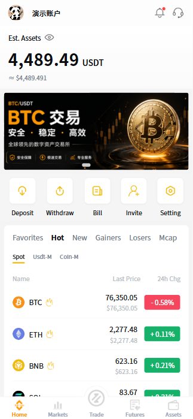
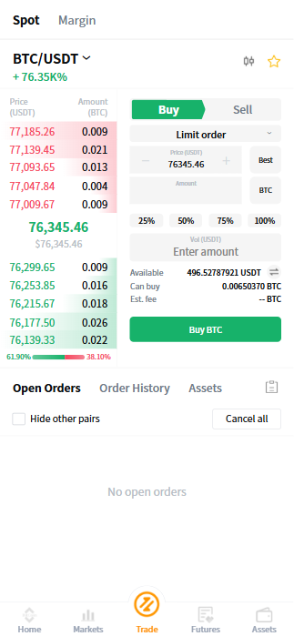
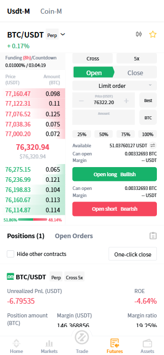
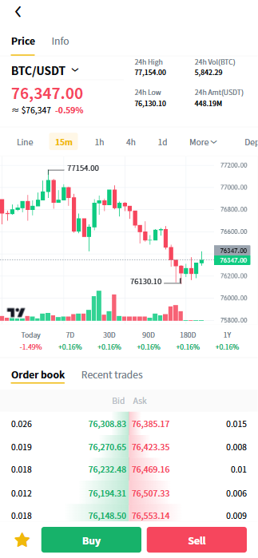
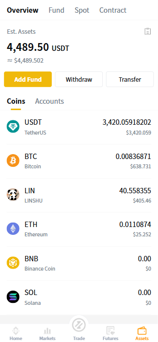
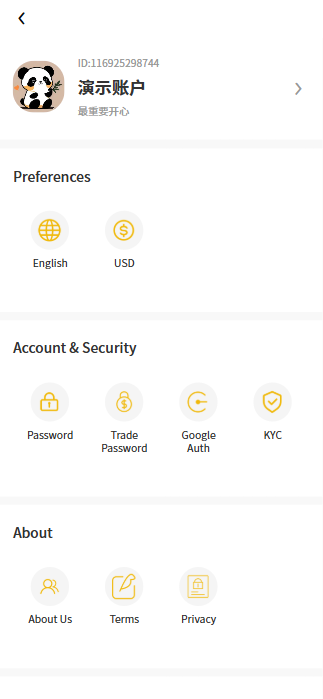
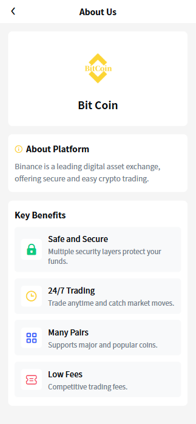
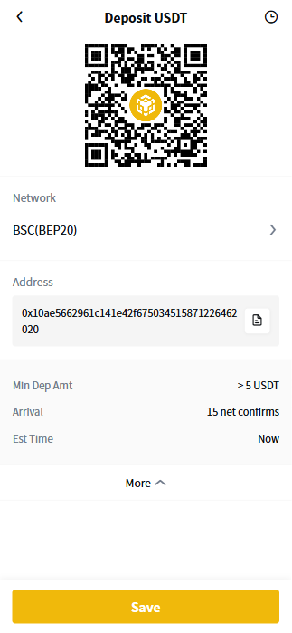

<p align="center">
  
</p>
<h4 align="center">オープンソース暗号資産取引所アプリ</h4>
<p align="center">
 
 
 
 
 
 
 
 
</p>
<p align="center">
  <strong>Language:</strong> <a href="./README_EN.md">English</a> | <a href="./README.md">中文</a> | 日本語 | <a href="./README_KO.md">한국어</a>
</p>

> **本プロジェクトは、ブロックチェーン型デジタル資産取引所向けのフロントエンドシステムです。**  
> 現物/先物取引、入出金、資金振替、相場購読、Kライン表示、多言語対応、マルチプラットフォーム配信に対応しています。  
> 取引所の迅速な立ち上げと二次開発に適しており、要件に合わせて機能拡張とバックエンド連携が可能です。

### アプリ画面

<table align="center">
  <tr>
    <td align="center"></td>
    <td align="center"></td>
    <td align="center"></td>
    <td align="center"></td>
  </tr>
  <tr>
    <td align="center"></td>
    <td align="center"></td>
    <td align="center"></td>
    <td align="center"></td>
  </tr>
</table>

### 管理画面

<table align="center">
  <tr>
    <td align="center"></td>
    <td align="center"></td>
    <td align="center"></td>
    <td align="center"></td>
  </tr>
  <tr>
    <td align="center"></td>
    <td align="center"></td>
    <td align="center"></td>
    <td align="center"></td>
  </tr>
</table>

``` 
binance_app（フロントエンド構成）
    ├── pages                                // メイン（タブ）ページ
    │       └── index / market / trade / contract / asset
    ├── sub_package                          // 機能別サブパッケージ
    │       └── login / trade / contract / kline / fund
    │       └── transfer / borrow / bill / asset
    │       └── message / notice / search / setting / customer
    ├── components                           // 業務コンポーネント
    │       └── custom-kline / custom-depth / custom-trade-order
    │       └── custom-contract-order / custom-contract-position
    │       └── custom-contract-lever / custom-contract-stoploss
    ├── config                               // 設定（api.js, baseConfig.js）
    ├── utils                                // request, websocket, interceptor, coin, storage
    ├── locale                               // 多言語（zh-Hans / zh-Hant / English）
    └── uni_modules/vk-uview-ui              // UI コンポーネントライブラリ
```

``` 
binance_app（主要機能）
    ├── ユーザー/アカウント
    │       └── 新規登録 / ログイン / パスワード再設定
    │       └── KYC / Google認証 / 資金パスワード / セキュリティ設定
    ├── マーケット
    │       └── 現物 / USDT-M先物 / Coin-M先物 相場
    │       └── ランキング、検索、お気に入り、WebSocket配信
    ├── 取引（現物 + マージン）
    │       └── 指値 / 成行 / TP-SL、板情報、約定、Kライン
    ├── 先物（USDT-M + Coin-M）
    │       └── 建玉/決済、レバレッジ、クロス/分離、資金調達率、ポジション管理
    ├── 資産/資金
    │       └── 入金、出金、振替、明細、口座サマリー
    ├── 運用/サポート
    │       └── バナー、公告、メッセージセンター、カスタマーサポート
    └── プラットフォーム機能
            └── 多言語 + マルチプラットフォーム（H5 / iOS / Android）
```

### お問い合わせ

ソースコードライセンス、カスタム開発、デプロイ、見積もりについては以下までご連絡ください。

<table align="center">
  <tr>
    <td align="center" valign="top">
      <a href="https://t.me/web3_dev_gg" target="_blank">Telegram ビジネス問い合わせ（クリックして開始）</a><br/>
      <br/>
    </td>
  </tr>
</table>

## FAQ

### 1) 二次開発に対応していますか？
はい。UI、取引フロー、資産モジュール、運用セクション、API連携を要件に応じてカスタマイズできます。

### 2) フロント/バックエンドのソースコードは含まれますか？
はい。ライセンスプランに応じてフロントエンド・バックエンドのソースコードを提供可能です。

### 3) デプロイ支援は可能ですか？
はい。検証環境/本番環境のデプロイ、ドメイン設定、Nginxリバースプロキシ、連携テストを支援します。

### 4) 多言語・マルチプラットフォーム対応ですか？
はい。簡体字中国語、繁体字中国語、英語に対応し、H5 / iOS / Android へ配信可能です。

### 5) 連絡方法は？
上記 Telegram までご連絡ください。要件、予算、希望スケジュールを共有いただくと対応がスムーズです。

## 免責事項

本プロジェクトはデジタル資産取引システムの技術デモおよび二次開発基盤です。投資助言や金融サービスの提供を目的としたものではありません。

- 学習、技術評価、デモ用途を想定しています。
- 暗号資産およびレバレッジ取引は高リスクであり、運用・法令順守の責任は利用者が負います。
- 本プロジェクトは現状有姿で提供され、可用性・安定性・安全性・収益性を保証しません。
- ユーザーデータを扱う場合は、利用者が各国・地域の法令およびプライバシー要件を満たす必要があります。
- 本プロジェクトは主要取引所のUXを参考にした実装であり、Binance公式製品ではなく、提携・認可関係はありません。
