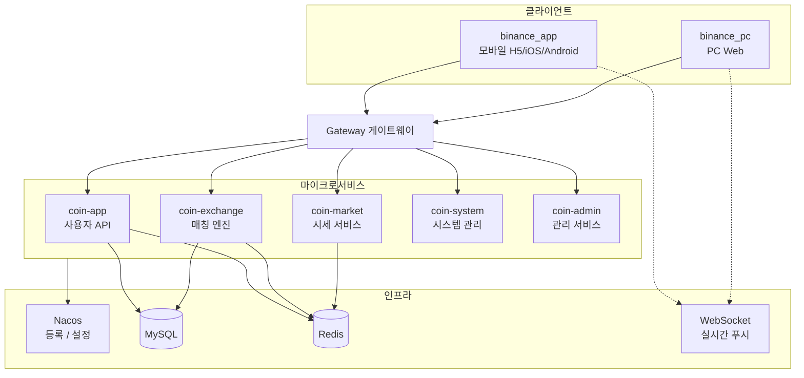

<p align="center">
	
</p>

<h1 align="center">Crypto Exchange — 디지털 자산 거래소 솔루션</h1>

<p align="center">
  
  
  
  
  
  
  
</p>

<p align="center">
  <strong>Language:</strong> <a href="./README_EN.md">English</a> | <a href="./README.md">中文</a> | <a href="./README_JA.md">日本語</a> | 한국어
</p>

<p align="center">
  모바일, PC Web, 운영 관리 콘솔, 마이크로서비스 백엔드를 아우르는 <strong>중앙화 디지털 자산 거래소</strong> 솔루션.<br/>
  현물, 레버리지, USDT/코인 마진 선물, 입출금, 이체, 실시간 시세, K라인을 지원합니다. 온라인 데모를 체험해 보세요 — 소스코드 및 배포는 문의해 주세요.
</p>

---

## 온라인 데모

| 플랫폼 | URL | 설명 |
|--------|-----|------|
| **App H5** | [http://45.76.150.181:8089/](http://45.76.150.181:8089/) | 모바일 브라우저 체험 |
| **PC Web** | [http://45.76.150.181:8091/](http://45.76.150.181:8091/) | 데스크톱 거래 워크스페이스 |

| 데모 계정 | 비밀번호 | 이메일 인증 코드 |
|-----------|----------|------------------|
| `111@gmail.com` | `111111` | `123456` |

> 데모 환경은 기능 체험 전용입니다. 데이터는 주기적으로 초기화될 수 있습니다. 실제 자산 조작은 금지합니다.

---

## 기능 특성

- **멀티 플랫폼** — 모바일 App (H5 / iOS / Android), PC Web, 운영 관리 콘솔
- **현물 & 레버리지** — 지정가/시장가/TP-SL, 호가창, K라인 연동, 대출/상환
- **선물 거래** — USDT/코인 마진, 격리/교차, 레버리지, 펀딩비, 강제청산
- **자산 관리** — 입출금 (멀티체인), 이체, 전체 명세 추적
- **실시간 시세** — WebSocket 가격, 호가, 체결, K라인 푸시
- **계정 보안** — KYC, Google 인증, 자금 비밀번호, 로그인 보호
- **운영 기능** — 배너, 공지, 메시지, 고객 지원, 초대
- **다국어** — 간체중문 / 번체중문 / English
- **확장성** — 프론트/백 분리, 마이크로서비스, 모듈 단위 커스터마이징

---

## 프로젝트 구성

모듈형 아키텍처 — 각 모듈을 독립 배포하거나 조합 가능:

| 모듈 | 설명 | 기술 스택 |
|------|------|-----------|
| **binance_app** | 모바일 클라이언트 | uni-app + Vue 3 + Vite |
| **binance_pc** | PC Web 클라이언트 | Vue 3 + TypeScript + Element Plus |
| **binance_coin** | 백엔드 마이크로서비스 | Spring Boot 3 + Spring Cloud + Nacos |

모바일과 PC는 동일한 백엔드 API (`coin-app` 마이크로서비스)를 공유하며 기능이 일치합니다.

> 본 저장소는 **프로젝트 소개 및 쇼케이스 입구**입니다. 데모, 스크린샷, 아키텍처 설명을 포함합니다. 전체 소스코드는 아래 연락처로 문의해 주세요.

---

## 시스템 아키텍처



**요청 경로:** 클라이언트 → Gateway → 마이크로서비스 → MySQL / Redis  
**실시간 데이터:** WebSocket으로 시세, 호가, 체결 푸시

---

## 기술 스택

| 계층 | 기술 | 설명 |
|------|------|------|
| 모바일 | uni-app, Vue 3, Vite, Pinia, vk-uview-ui | H5 / iOS / Android |
| PC Web | Vue 3, TypeScript, Vite, Element Plus | 1280px+ 고정 데스크톱 레이아웃 |
| 관리 콘솔 | Vue 3, Element Plus, Avue | 운영 관리 + 업무 설정 |
| 백엔드 | Spring Boot 3.2, Spring Cloud Alibaba | Java 17 |
| 마이크로서비스 | Nacos, Gateway, OpenFeign | 서비스 등록 및 라우팅 |
| 스토리지 | MySQL, Redis, MyBatis-Plus | 비즈니스 데이터 + 캐시 |
| 실시간 | WebSocket (MQTT 래퍼) | 시세 / 호가 / K라인 / 체결 |
| 차트 | lightweight-charts | K라인 표시 |
| 빌드 | Maven (백엔드), Vite (프론트) | — |

---

## 화면 전시

### 모바일 App

<table align="center">
  <tr>
    <td align="center"></td>
    <td align="center"></td>
    <td align="center"></td>
    <td align="center"></td>
  </tr>
  <tr>
    <td align="center"></td>
    <td align="center"></td>
    <td align="center"></td>
    <td align="center"></td>
  </tr>
</table>

### PC Web

<table align="center">
  <tr>
    <td align="center"></td>
    <td align="center"></td>
  </tr>
  <tr>
    <td align="center"></td>
    <td align="center"></td>
  </tr>
  <tr>
    <td align="center"></td>
    <td align="center"></td>
  </tr>
  <tr>
    <td align="center"></td>
    <td align="center"></td>
  </tr>
</table>

### 관리 콘솔

<table align="center">
  <tr>
    <td align="center"></td>
    <td align="center"></td>
    <td align="center"></td>
    <td align="center"></td>
  </tr>
  <tr>
    <td align="center"></td>
    <td align="center"></td>
    <td align="center"></td>
    <td align="center"></td>
  </tr>
</table>

---

## 디렉터리 구조

<details open>
<summary><strong>binance_app — 모바일</strong></summary>

```
binance_app/
├── pages/              # 메인 탭 (홈, 시세, 거래, 선물, 자산)
├── sub_package/        # 서브 패키지 (로그인, K라인, 입출금, 명세, 설정 등 40+ 페이지)
├── components/         # 비즈니스 컴포넌트 (custom-kline, custom-trade-order 등)
├── config/             # api.js, baseConfig.js
├── utils/              # request, websocket, coin 포맷
└── locale/             # 다국어 (zh-Hans / zh-Hant / English)
```

</details>

<details open>
<summary><strong>binance_pc — PC Web</strong></summary>

```
binance_pc/
├── src/views/          # 페이지 (index, trade, contract, bills, settings)
├── src/components/     # 비즈니스 컴포넌트 (custom-kline, custom-trade-depth 등)
├── src/router/         # 라우트 (routes-constants.ts)
├── src/config/         # api.ts, baseConfig.ts
└── src/utils/          # request, websocket, 글로벌 모달
```

</details>

<details open>
<summary><strong>binance_coin — 백엔드 마이크로서비스</strong></summary>

```
binance_coin/
├── coin-gateway/              # API 게이트웨이
├── coin-service/
│   ├── coin-service-app/      # coin-app 사용자 업무
│   ├── coin-service-exchange/ # coin-exchange 매칭 엔진
│   ├── coin-service-market/   # coin-market 시세
│   ├── coin-service-system/   # coin-system 시스템 관리
│   └── coin-service-message/  # 메시지 알림
├── coin-common/               # 공통 모듈
└── coin-service-api/          # RPC 인터페이스 정의
```

</details>

---

## 상업 지원

**전체 소스 라이선스, 맞춤 개발, 배포** 등은 아래로 문의해 주세요:

<table align="center">
  <tr>
    <td align="center" valign="top">
      <a href="https://t.me/BITCOIN1688" target="_blank">Telegram 고객센터</a><br/>
      
    </td>
    <td align="center" valign="top">
      <a href="https://t.me/bitcoin5201688" target="_blank">Telegram 그룹</a><br/>
      
    </td>
  </tr>
</table>

---

## FAQ

### 소스코드는 어떻게 받나요?
본 저장소는 기능 쇼케이스용이며 전체 소스코드는 포함되지 않습니다. 라이선스, 배포, 맞춤 개발은 위 Telegram으로 문의해 주세요.

### 2차 개발이 가능한가요?
네. UI, 거래 플로우, 자산 모듈, 운영 기능을 요구사항에 맞게 커스터마이징할 수 있습니다.

### 프론트엔드와 백엔드가 포함되나요?
모바일, PC Web, 운영 관리 콘솔, 마이크로서비스 백엔드를 아우르며, 조합하여 제공 가능합니다.

### 지원 플랫폼은?
모바일: H5, iOS, Android; 데스크톱: PC Web; 관리: 브라우저.

### 배포 지원이 가능한가요?
네. 스테이징/운영 배포, 도메인 설정, 기본 연동을 지원합니다. 자세한 내용은 문의해 주세요.

---

## 면책 조항

본 프로젝트는 디지털 자산 거래 시스템의 기술 쇼케이스 및 개발 기반입니다. **투자 자문이나 금융 서비스 제공을 의미하지 않습니다.**

- 학습, 데모, 기술 평가 목적 전용 — 무허가 금융 업무 운영에 사용 금지
- 암호자산 및 레버리지 거래는 고위험이며, 운영 및 규제 준수 책임은 사용자에게 있습니다
- 본 프로젝트는 "있는 그대로" 제공되며 가용성, 안정성, 보안성, 수익성을 보장하지 않습니다
- 사용자 데이터를 수집/처리하는 경우, 사용자는 관련 법률 및 개인정보 규정을 준수해야 합니다
- 주요 거래소 UX를 참고한 구현이며 **Binance 공식 제품이 아니며** 제휴/승인 관계가 없습니다
