# 币安风格数字资产交易 App（源码可授权/可出售）

> **参考币安交互与视觉风格**打造的数字资产交易 App 前端项目  
> 面向团队二次开发：支持现货、杠杆、U 本位合约、币本位合约、资产、消息与运营能力  
> **支持源码授权/出售**，可快速改 UI、改业务、接后端上线

### 联系方式

<table>
  <tr>
    <td align="center" valign="top">
      <a href="https://t.me/web3_dev_gg" target="_blank">Telegram 客服（需要购买源码请联系）</a> 
      
    </td>
  </tr>
</table>

---

## 1. 产品定位

本产品是一套“**币安风格**”的数字资产交易 App 前端工程，更强调“**可二开**、**可扩展**、**可快速交付**”。适用于：

- 交易平台自建品牌 App
- 海外市场多语言运营
- 社区型项目交易与资产管理入口
- 合约与杠杆业务扩展场景
- 外包/技术团队快速交付项目（基于源码二次开发）

### 1.1 前后端技术架构

- 前端采用 `uni-app + Vue3` 组件化架构，统一交易、资产、账户、运营等业务模块，支持多端发布与多语言扩展。
- 网关层统一处理鉴权、路由分发与风控拦截，对外提供标准化 API，便于对接不同后端服务。
- 业务服务层按领域拆分（用户、行情、交易、合约、资金、运营），支持模块化扩展和按需替换。
- 实时通道采用 `WebSocket` 推送行情、盘口、订单与仓位变化，HTTP 接口负责下单、查询和配置读取。
- 数据与运维层可按项目规模接入 MySQL/Redis/消息队列等基础设施，支持日志监控、告警和灰度发布。

<table>
  <tr>
    <td>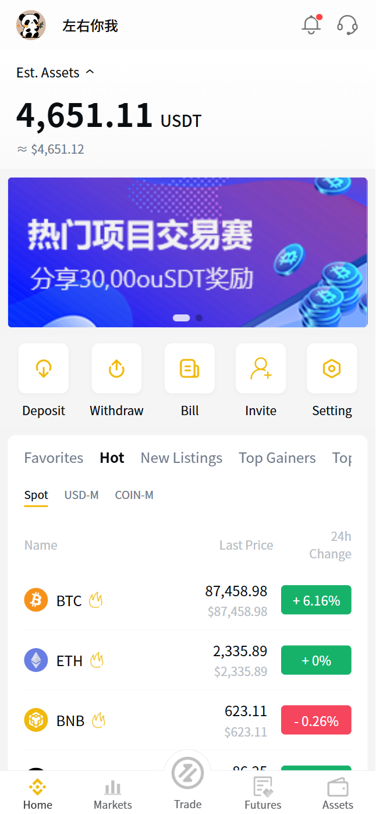</td>
    <td>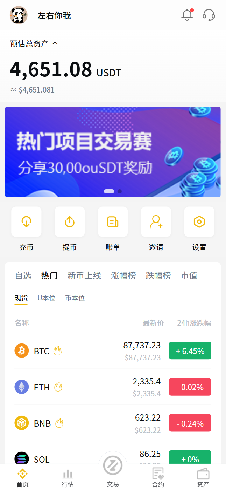</td>
  </tr>
</table>

---

## 2. 核心业务能力

### 2.1 首页与内容运营

- 首页资产总览（未登录/已登录态）
- Banner 轮播运营位（支持后端动态配置）
- 功能快捷入口（充币、提币、账单、邀请、设置）
- 交易倒计时模块（待上线交易对）
- 公告中心与详情页联动

<table>
  <tr>
    <td></td>
    <td></td>
  </tr>
</table>

### 2.2 行情中心

- 热门/新币/涨幅榜/跌幅榜/市值等多维榜单
- 现货、U 本位、币本位分类切换
- 搜索与历史搜索
- 实时价格与涨跌幅更新（WebSocket）
- 交易对快速跳转交易页/合约页

<table>
  <tr>
    <td>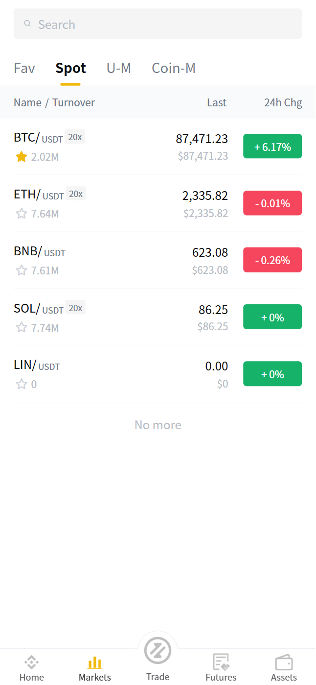</td>
    <td>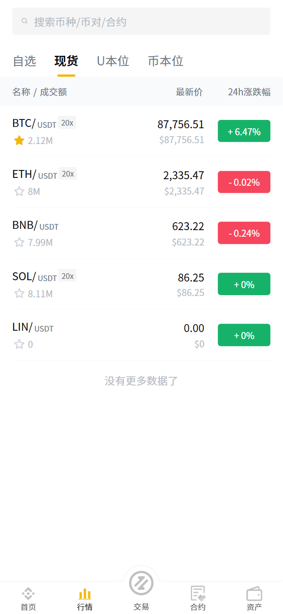</td>
  </tr>
</table>
<table>
  <tr>
    <td>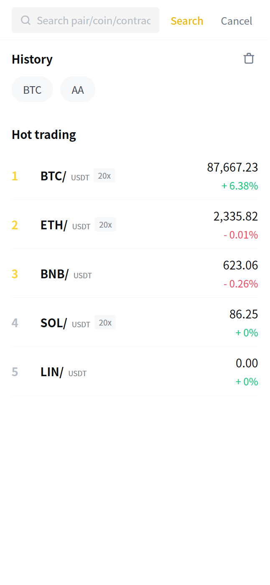</td>
    <td>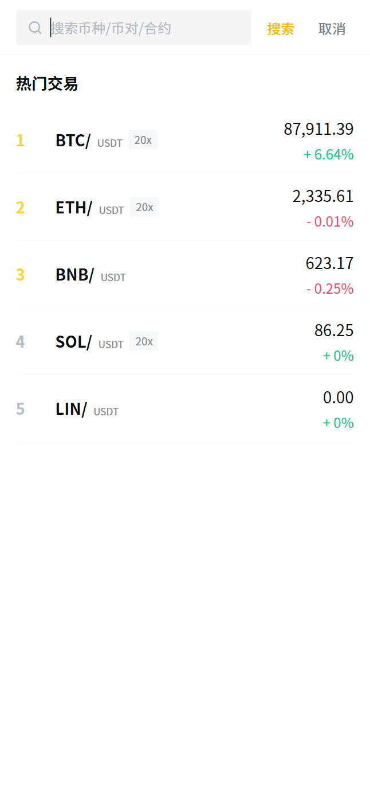</td>
  </tr>
</table>

### 2.3 交易能力（现货 + 杠杆）

- 多类型下单能力（限价、市价、止盈止损）
- 深度图、盘口、K 线联动
- 当前委托、历史委托、资产三合一底部面板
- 一键撤单、批量撤单、订单详情展示
- 杠杆模式下借还逻辑与风险提示能力

<table>
  <tr>
    <td>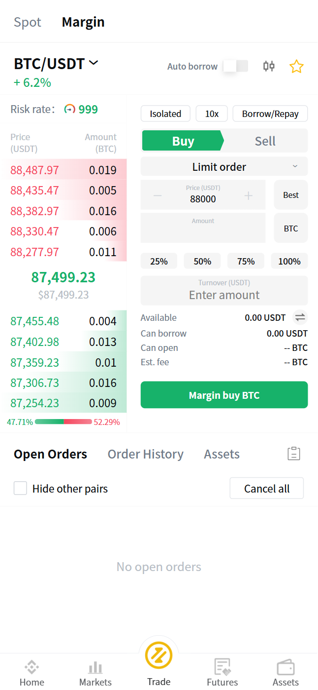</td>
    <td>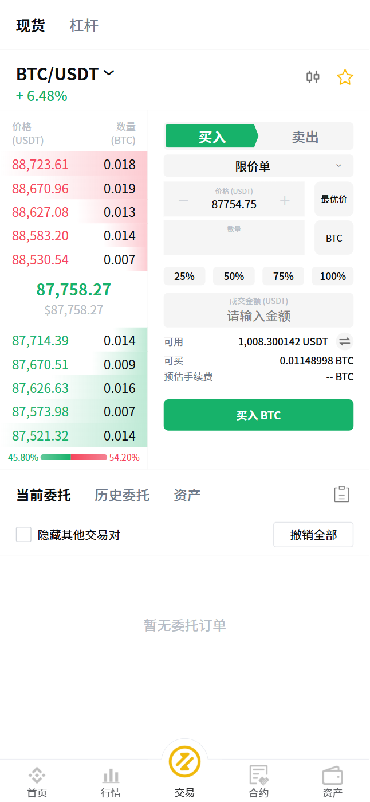</td>
  </tr>
</table>
<table>
  <tr>
    <td>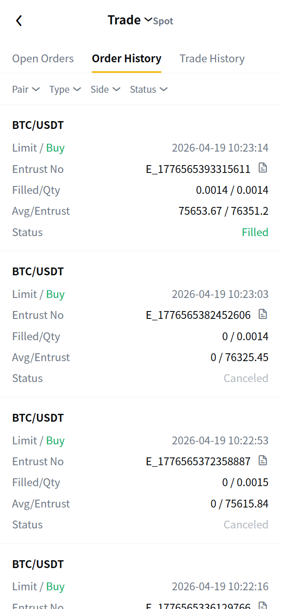</td>
    <td>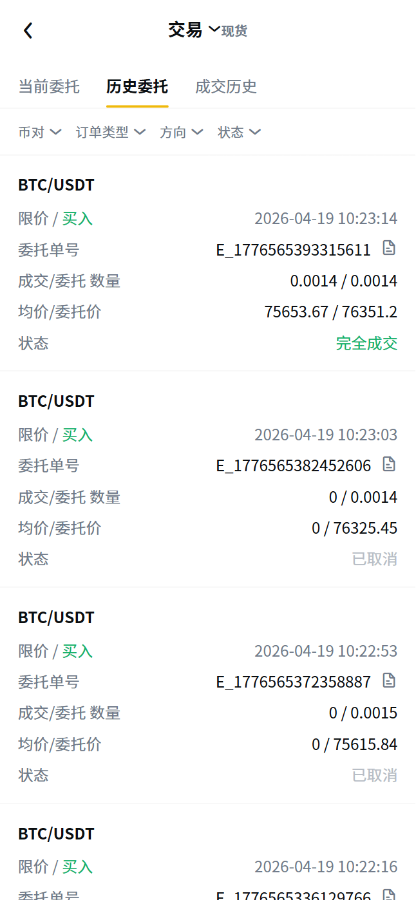</td>
  </tr>
</table>

### 2.4 合约交易能力（U 本位 + 币本位）

- 双合约体系支持：U 本位、币本位
- 仓位模式与杠杆调整
- 加减保证金、强平价联动显示
- 止盈止损弹窗与仓位管理
- 持仓、当前委托、历史委托完整闭环

<table>
  <tr>
    <td>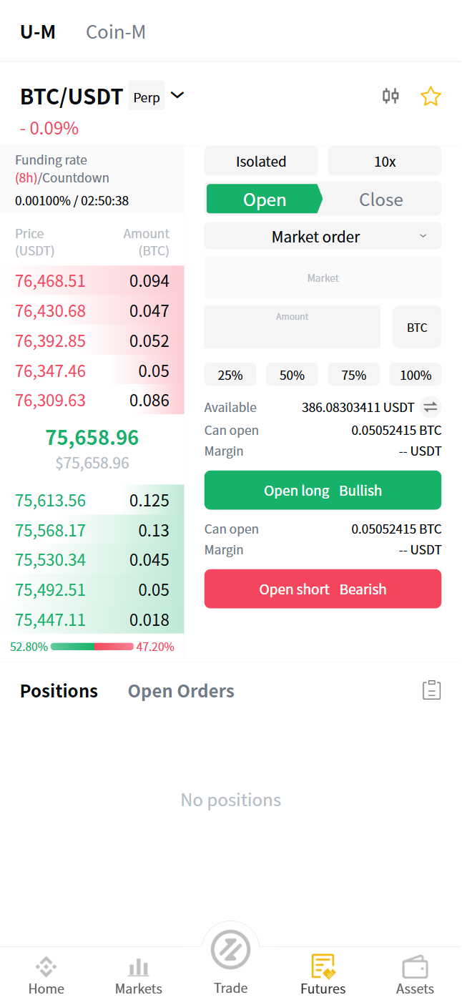</td>
    <td>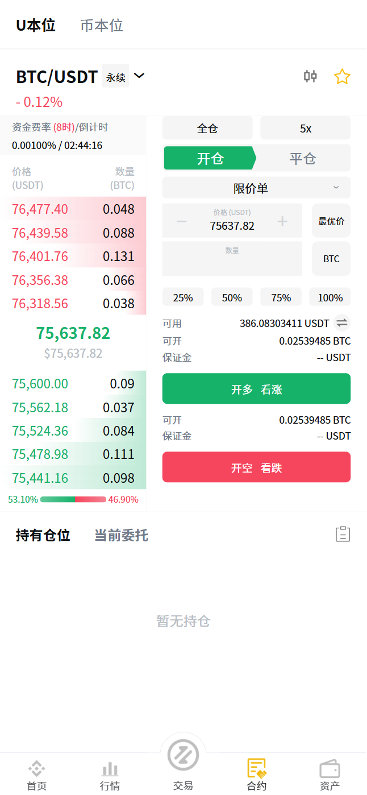</td>
  </tr>
</table>
<table>
  <tr>
    <td>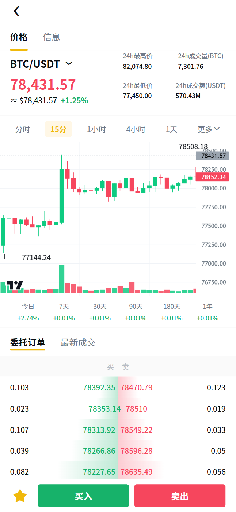</td>
    <td>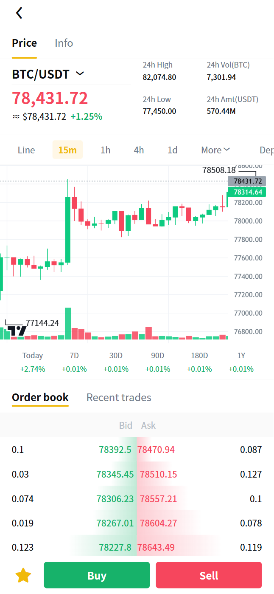</td>
  </tr>
</table>

### 2.5 资金与资产体系

- 资产总览与币种明细
- 充币流程（方式选择、币种选择、网络选择）
- 提币流程（方式选择、币种选择、网络选择）
- 账单体系（现货、杠杆、合约多维账单）
- 借贷与还款入口联动

<table>
  <tr>
    <td>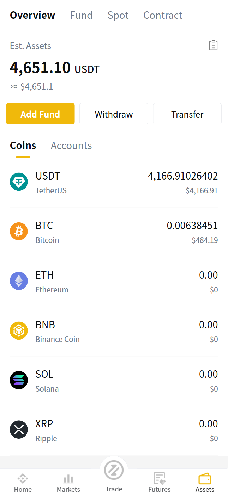</td>
    <td>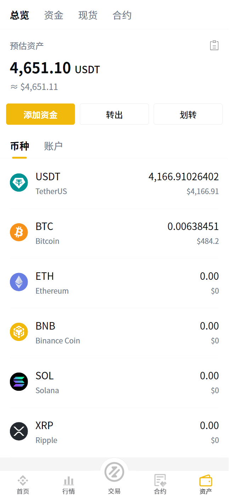</td>
  </tr>
</table>
<table>
  <tr>
    <td>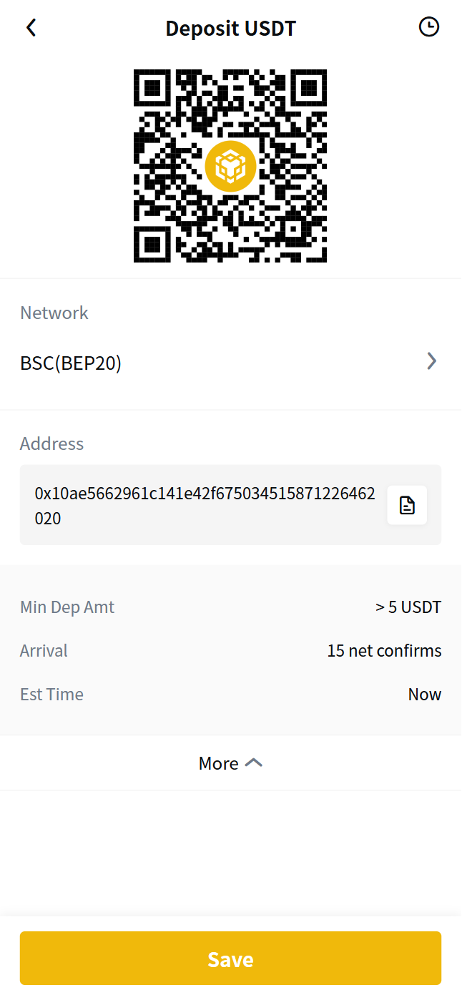</td>
    <td>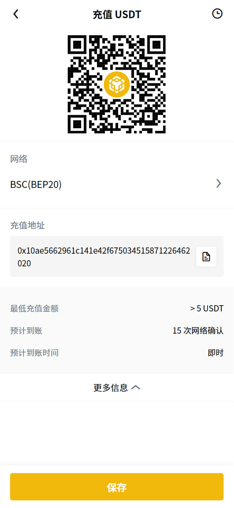</td>
  </tr>
</table>
<table>
  <tr>
    <td>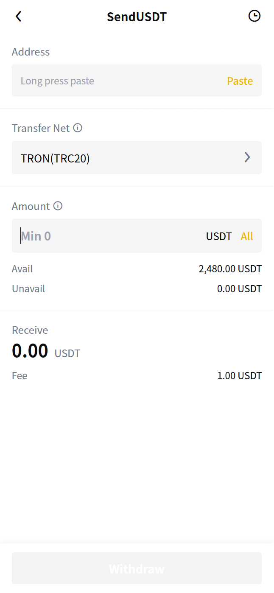</td>
    <td>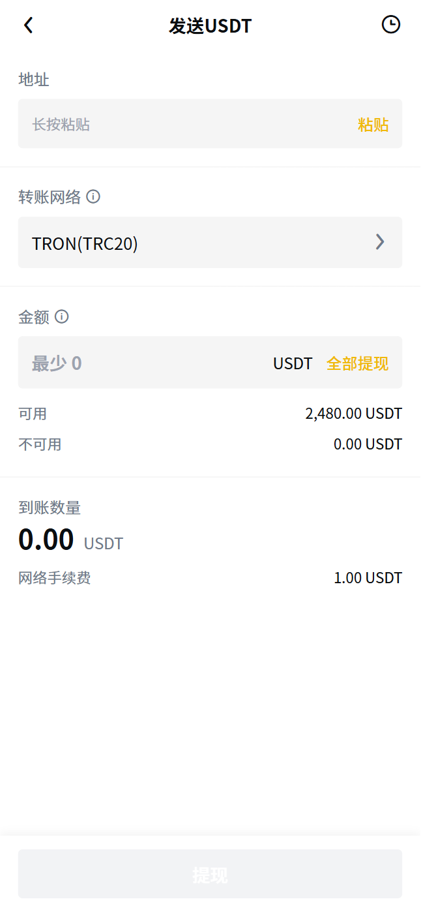</td>
  </tr>
</table>

### 2.6 账户与用户中心

- 登录/注册/找回密码
- 消息中心（含未读状态）
- KYC、隐私政策、服务条款
- 设置中心（语言、账户、系统配置）

<table>
  <tr>
    <td>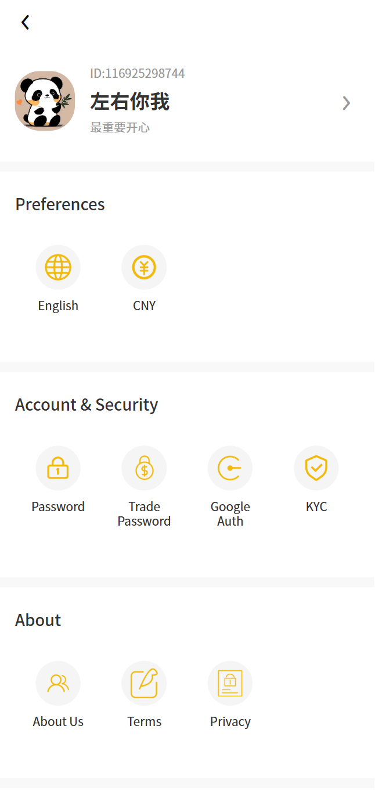</td>
    <td>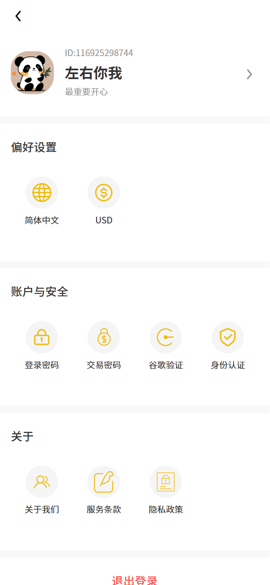</td>
  </tr>
</table>

---

## 3. 产品特色（对外卖点）

- **多市场覆盖**：现货、杠杆、合约统一体验
- **高频场景完整**：从看行情、下单到资产管理全闭环
- **国际化能力完善**：支持简中/英文/繁中，文案可持续扩展
- **运营能力强**：Banner、公告、榜单、新币等运营位完善
- **用户体验友好**：关键路径短、交互清晰、状态反馈完整
- **可扩展架构**：可按业务需求接入更多产品模块
- **二次开发友好**：组件化拆分，便于替换主题、文案、页面与业务逻辑
- **交付快**：基于成熟 UI/交互范式，减少试错与设计成本

---

## 4. 典型使用场景

- 新交易所快速发布品牌 App
- 已有交易平台升级多语言版本
- 合约业务从 0 到 1 上线
- 海外增长场景下统一多区域产品体验

<table>
  <tr>
    <td></td>
    <td></td>
  </tr>
</table>

---

## 5. 系统能力清单（丰富功能版）

### 5.1 交易侧

- 现货下单
- 杠杆下单
- U 本位合约下单
- 币本位合约下单
- 止盈止损设置
- 一键撤单 / 撤销全部
- 一键平仓 / 单仓平仓
- 持仓收益与风险指标展示

### 5.2 行情侧

- 多榜单展示
- 多分类交易对
- K 线周期切换（含更多周期）
- 深度图与盘口联动
- 实时推送刷新

### 5.3 资金侧

- 充币入口与链上充币
- 提币入口与链上提币
- 资产明细与可用/冻结等字段
- 借贷、还款、利息展示
- 多模块账单查询

### 5.4 用户与运营侧

- 登录/注册
- 消息通知
- 公告运营
- 邀请裂变入口
- 设置与协议管理

---

## 6. 技术与工程优势

- 基于 uni-app 体系，支持多端能力扩展
- 组件化架构，页面与业务模块边界清晰
- WebSocket 实时行情/订单更新能力
- 国际化体系完善（i18n 多语言资源）
- 可维护性好：模块化目录与统一风格

<table>
  <tr>
    <td></td>
    <td></td>
  </tr>
</table>

> 架构图建议后续替换为：前端模块 / API 网关 / 行情与交易推送（WebSocket）三层结构图。

---

## 8. 产品截图总览

### 8.1 首页与运营

<table>
  <tr>
    <td></td>
    <td></td>
  </tr>
</table>

### 8.2 行情与搜索

<table>
  <tr>
    <td></td>
    <td></td>
  </tr>
</table>
<table>
  <tr>
    <td></td>
    <td></td>
  </tr>
</table>

### 8.3 交易与订单

<table>
  <tr>
    <td></td>
    <td></td>
  </tr>
</table>
<table>
  <tr>
    <td></td>
    <td></td>
  </tr>
</table>

### 8.4 合约与K线

<table>
  <tr>
    <td></td>
    <td></td>
  </tr>
</table>
<table>
  <tr>
    <td></td>
    <td></td>
  </tr>
</table>

### 8.5 资产与充提

<table>
  <tr>
    <td></td>
    <td></td>
  </tr>
</table>
<table>
  <tr>
    <td></td>
    <td></td>
  </tr>
</table>
<table>
  <tr>
    <td></td>
    <td></td>
  </tr>
</table>

### 8.6 设置与账户

<table>
  <tr>
    <td></td>
    <td></td>
  </tr>
</table>

---

## 9. 免责声明与商标说明（对外宣传建议）

本系统为数字资产交易类产品解决方案展示文档。实际上线业务请结合目标市场监管政策、风控规范与合规要求执行。

### 9.1 使用范围声明（仅供教学/研究/演示）

本项目及其相关文档/截图/源码仅用于：

- 高校/科研机构的**教学、研究、课程设计、毕业设计**等非商业用途
- 产品/技术团队的**功能演示、交互验证、二次开发评估**等用途

不用于（也不支持）：

- **投资理财建议**、荐币、带单、收益承诺等任何金融营销行为
- 向公众提供交易撮合、资产托管、理财、合约杠杆等**实际金融服务**
- 任何形式的**募资、集资、代投、资金盘**或变相金融活动
- 在未获得必要资质/许可的情况下进行商业运营或对外推广上线

### 9.2 风险提示与责任边界

- **非投资建议**：文档中出现的“行情/交易/收益/涨跌”等内容仅为功能描述，不构成任何投资建议或要约邀请。
- **高风险提示**：数字资产交易具有高波动、高杠杆、高风险特征，可能导致本金全部损失；请自行评估并谨慎决策。
- **合规责任自担**：任何基于本项目的部署、上线、运营、对外宣传及用户资金相关活动，均由实际运营方自行承担合规与法律责任。
- **无担保/无承诺**：本项目不对可用性、准确性、稳定性、安全性、收益性作任何明示或默示担保。
- **数据与隐私**：若二次开发涉及用户数据收集、存储、传输，请按当地法律法规与隐私合规要求执行，并做好安全防护。
- **第三方依赖**：项目使用的第三方组件/服务/接口可能随时变更，使用者需自行评估其风险与兼容性。

同时说明：

- 本项目为**参考/仿照主流交易所（含币安）交互风格**的二次开发基座，**并非币安官方产品**，也不代表与币安存在合作/授权关系。
- “Binance / 币安”及相关标识可能属于其权利人所有；对外宣传建议避免使用易引发误解的官方措辞与 Logo/商标元素，必要时请咨询法务合规意见。

