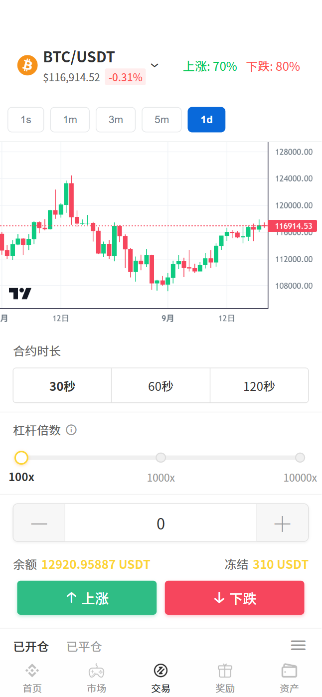
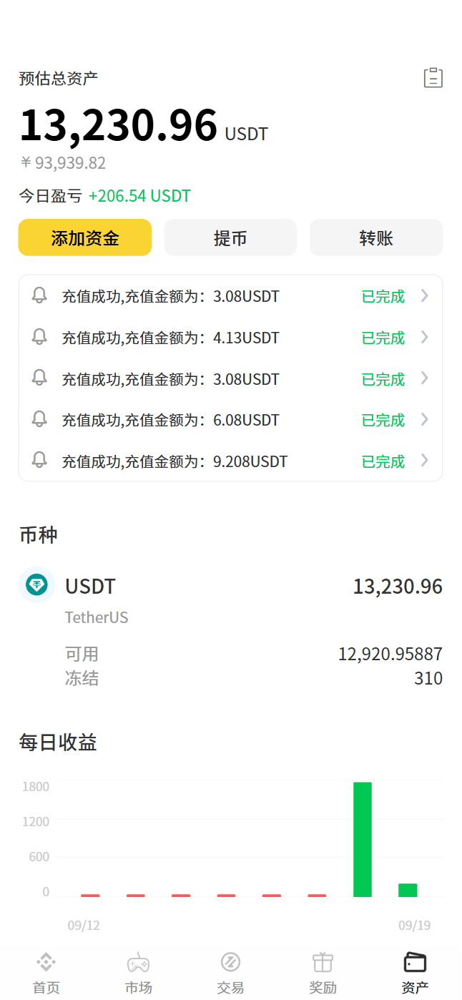

<p align="center">
	
</p>
<h4 align="center">BTC/USDT超级合约</h4>
<p align="center">
 
 
 
 
 
 
 
 
</p>

## 1.项目简介

BTC超级合约震撼上线，专为短线之王打造。30秒K线，价杠杆从100倍到10000倍自由滑选，方向看对即可放大收益。合约周期内全程零爆仓，系统自动锁仓，无惧插针，安心持仓到结算。链上数据源，公开透明，收益实时实时结算。

## 2.代码架构
``` 
项目基于ruoyi框架，安全、稳定、高效、快捷上手
vex-api  
    ├── ruoyi-api                     // 对接app模块的接口
    ├── ruoyi-common                  // 公共模块
    ├── ruoyi-framework               // 项目框架模块
    ├── ruoyi-kline                   // K线模块 
    ├── ruoyi-mqtt                    // 对接app的socket模块
```
## 3.项目推荐

| 项目                                                                    | Star |
|-----------------------------------------------------------------------|--|
| [私钥破解、助记词破解,助记词找回](https://github.com/EthCollision/wallet_collission) |  [](https://github.com/EthCollision/wallet_collission)   | 

## 4.合作/购买源码：
 
<table>
  <tr>
    <td >客服TG:BitCoin1688</td>
  </tr>
  <tr>
    <td ></td>
  </tr>
</table>

## 5.玩法

用户A 选择30s，然后杠杆倍数是100倍，开仓金额10,000USDT,赔率为80% ,当前BTC/USDT的价格是100,000<br>
开多,如果30s后，当前BTC/USDT的价格是101,000，则用户盈利的计算方式：<br>
(10000**100)/10000=100BTC 当前开了100个BTC <br>
100*(101000-100000)*0.8=80000USDT  <br>

## 6.系统效果图

<table>
    <tr>
        <td >首页</td>
        <td >交易</td>
    </tr>
    <tr>
        <td ></td>
        <td ></td>
    </tr>
    <tr>
        <td >资产</td>
        <td >排行榜</td>
    </tr>
    <tr>
        <td ></td>
        <td ></td>
    </tr>
    <tr>
        <td >邀请</td>
        <td >个人</td>
    </tr>
    <tr>
        <td ></td>
        <td ></td>
    </tr>
    <tr>
        <td >我的邀请</td>
        <td >我的奖励</td>
    </tr>
    <tr>
        <td ></td>
        <td ></td>
    </tr>

</table>

## 7.法律风险
法律风险第一条：不要触犯中华人民共和国的法律条例。</br>
技术无罪，请在法律范围内使用本框架。

## 8.特别注意
任何使用本源码从事商业活动，对别人和自己造成损失的，本人概不负责！